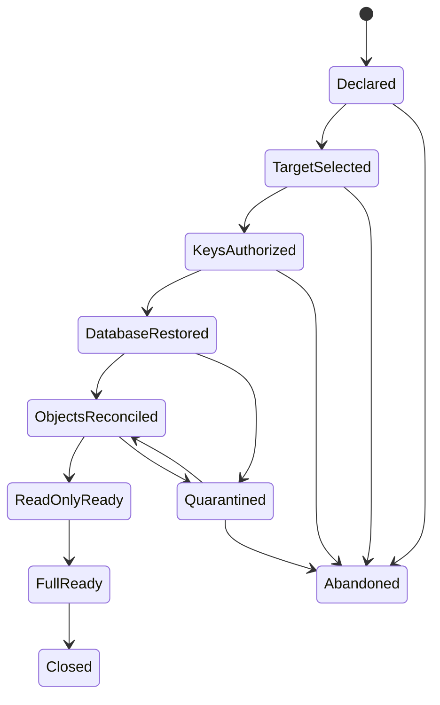

# Backup and Recovery

This document records the backup and recovery decisions confirmed while resolving GitHub issue 16. [CONTEXT.md](../../CONTEXT.md) is authoritative for domain language, [ADR 0019](../adr/0019-bind-recovery-to-joint-database-and-object-points.md) records the joint recovery decision, [durable-object-storage.md](./durable-object-storage.md) defines verified content, [runtime-and-pipeline-releases.md](./runtime-and-pipeline-releases.md) defines release, compatibility, revocation, and Execution Lock recovery requirements, [catalog-template-publication.md](./catalog-template-publication.md) defines catalog package, Template Lock, and disable recovery requirements, [llm-gateway-and-usage-accounting.md](./llm-gateway-and-usage-accounting.md) defines provider-attempt, receipt, ledger, and reservation recovery requirements, and [enterprise-v1-scope.md](./enterprise-v1-scope.md) defines the delivery boundary.

The design fixes recovery authority, RPO/RTO, consistency, retention, security, drills, and cutover gates without selecting a PostgreSQL backup product, object-store vendor, KMS, schema, SDK, or deployment size.

## Recovery classes and objectives

PostgreSQL business state and every durable byte referenced by that state form one compound recovery fact. They share one recovery point and one RPO; object categories differ only in restore priority and RTO.

| Recovery class | Required state | RPO | RTO |
| --- | --- | --- | --- |
| Business-publication set | PostgreSQL authoritative records, ownership and suppression facts, Task metadata, Artifact Versions and their exact members, Usage Ledgers, Gateway evidence roots, Usage Receipts, corrections, and Quota Reservation history | At most 15 minutes | Read-only access within four hours |
| Full business set | The publication set plus Source Material, Checkpoints, Execution Locks, Template Locks, approved release and catalog manifests, Compatibility Approvals, exact catalog package closures, scan/license evidence, lifecycle, revocation and disable inventories, required OCI Runtime Images and supplementary packages, and all mutation and execution dependencies | At most 15 minutes | Full operation within eight hours |
| Rebuildable execution material | Runtime Views, sandboxes, sessions, local materializations, caches, queue projections, and failed residue | No backup guarantee | Rebuilt on demand; no RTO |

RPO applies to sudden loss or compromise of the entire production site. RTO begins when the incident is formally declared and ends only when the corresponding promotion gate passes. A running process or reachable database does not constitute recovery.

## Authority and module boundary

An internal `Backup & Recovery` module in the Platform Control Plane owns:

- Recovery Point candidate and finalized state;
- the recovery watermark, recovery mode, and promotion gates;
- canonical Recovery Manifests and backup, restore, and drill evidence;
- orchestration across PostgreSQL, Durable Object, OCI registry, immutable repository, and KMS adapters.

It does not take over business or byte authority:

| Fact | Authority |
| --- | --- |
| Business identity, ownership, typed references, lifecycle, sharing, usage, deletion, tombstones, and retention intent | Platform PostgreSQL and the owning business module |
| Actual immutable object bytes and primary verification receipts | Durable Object and its store adapter |
| Recoverable encrypted copies and backup receipts | Independent immutable backup repository adapter |
| Runtime Image bytes | OCI registry and its backup adapter |
| Encryption and signing key material | Enterprise KMS or secret-custody adapter |
| Joint recovery evidence | Signed canonical Recovery Manifest derived from a PostgreSQL committed-reference inventory |

The independent backup repository is recovery evidence and byte storage, not a second business database. Its listing cannot create business records, references, ownership, or retention authority.

Ordinary business callers never receive WAL, snapshot, backup locator, repository credential, bucket, object key, or KMS interfaces. Administrative callers express high-level intents to create, inspect, plan, verify, promote, or abandon a Recovery Point or restore attempt.

## Joint Recovery Point protocol

PostgreSQL and object storage do not need a distributed transaction or coordinated vendor snapshot. A manifest-bound protocol creates a joint point:

1. The PostgreSQL adapter continuously archives WAL and periodically produces encrypted base backups. The default maximum base-backup interval is seven days, but an adapter must shorten it whenever required to meet the eight-hour full RTO.
2. The Durable Object backup adapter copies each committed immutable generation into the independent domain and verifies digest, size, policy domain, and immutable generation. Success produces a `BackupObjectReceipt`.
3. At a transaction-consistent PostgreSQL snapshot and target LSN, the module exports the committed-reference inventory. The inventory, rather than object-store listing, defines the recovery set.
4. The candidate waits for complete base/WAL coverage, all referenced object receipts, the exact Pipeline, Runtime, compatibility, package, OCI, lifecycle, and revocation inventories required by every retained Execution Lock and rollout or rollback pin, manifest chunks, suppression facts, and key-version evidence.
5. The module builds and authenticates a canonical Recovery Manifest and writes it to the independent immutable repository.
6. Locking that manifest is the Recovery Point linearization point. A PostgreSQL mirror record may be reconciled idempotently if the response is lost after the external lock succeeds.

Object copies can be reused across Recovery Points when their immutable evidence matches. Reuse never merges business identities or policy domains.

## Recovery Manifest and watermark

A canonical Recovery Manifest binds at least:

- opaque `RecoveryPointID`, target time, protected-through time, and prior point;
- PostgreSQL cluster identity, timeline, target LSN, base backup, WAL coverage, and schema/application compatibility;
- committed-reference inventory root plus counts and bytes by reference class and policy domain;
- `ContentID`, digest algorithm, digest, size, immutable generation, reference class, and backup receipt roots;
- release inventory root covering Execution Locks, exact Pipeline Version and Runtime Release manifests, Compatibility Approvals, lifecycle state, rollout and rollback pins, and revocations;
- OCI and package inventory roots plus every required image and supplementary-package digest;
- deletion, purge, and recovery-suppression inventory root;
- encryption and signing key versions;
- adapter and recovery-tool versions;
- canonical manifest digest and signature.

Large inventories may be stored as canonical immutable chunks; their ordered roots remain in the top-level manifest. Object locators and vendor metadata remain adapter-private.

The recovery watermark is the `protected-through` time of the newest finalized Recovery Point, not the time a backup job started or returned. No candidate, partial copy, unsigned manifest, or unverified snapshot advances it.

## RPO admission and read-only protection

Backup lag produces an early warning before the hard boundary. No later than the point where the newest finalized watermark would become older than 15 minutes, the Platform Control Plane enters `recovery-degraded/read-only` and fences authoritative mutation:

- reject Task mutation and new mutation-bearing Phase Runs;
- prevent Phase Run commit and Artifact Version publication;
- prevent release or catalog activation, rollout-policy mutation, deletion, and purge;
- allow a Runtime Run to terminate or retain non-authoritative evidence, but never commit its proposal;
- keep incomplete uploads inaccessible as staging for later reconciliation;
- continue authorized reads of already verified content.

The platform returns to normal only after the watermark catches up and the consistency gate succeeds. This mode is an authoritative Platform Control Plane fact, not a best-effort metric.

## Restore state machine

Restore always targets a new isolated environment. It never overwrites a suspect primary site in place.

1. `Declared`: record the incident, fence all mutation, isolate the old site, and invalidate all pre-incident Share Links and Access Codes.
2. `TargetSelected`: select the newest finalized Recovery Point by default. Selecting an older point intentionally accepts additional data loss and requires separate incident-specific human approval.
3. `KeysAuthorized`: activate dormant restore and decryption capabilities through dual control.
4. `DatabaseRestored`: recover base backup and WAL to the exact target, then verify cluster identity, schema, constraints, manifest root, and application compatibility.
5. `ObjectsReconciled`: restore and verify the exact committed object, Pipeline package, Runtime supplementary-package, catalog manifest and package closure, and OCI inventories, then reconcile the current independent release-revocation and catalog-disable inventories.
6. `ReadOnlyReady`: after the complete first-stage gate passes, allow reauthenticated Owners to browse Task metadata and read Artifact Versions.
7. `FullReady`: after the complete full-business set and write path are verified, create a fresh joint Recovery Point and then re-enable mutation and execution.
8. `Closed`: seal timelines, counts, differences, approvals, drill or incident evidence, and follow-up actions.

Each attempt has an opaque generation and fencing token. Transitions and adapter operations are idempotent. A retry cannot promote twice, overwrite a newer attempt, reuse an abandoned capability, or infer completion from files or processes.

Internal verification may expose progress by reference class, but an official RTO gate passes only when 100% of that stage's required references, digests, counts, and bytes succeed.

## Reconciliation and exact repair

- A PostgreSQL reference whose primary object is missing or corrupt creates an integrity incident and blocks affected reads and promotion. Repair may use only a backup or controlled source that exactly matches the original digest, size, manifest, and policy evidence.
- If no exact copy exists, the expected digest is never changed and replacement bytes are never invented. The RPO/RTO gate fails.
- A physical object without a PostgreSQL reference is an orphan. It remains inaccessible and is quarantined or reclaimed after evidence is recorded; it is never adopted from listing.
- Multiple exact physical generations may remain verified replicas. Only a receipt-bound generation can be selected; unrelated duplicates are handled as orphan evidence.
- Unactivated staging, expired leases, local cache, quarantine bytes, and pending deletion are not business recovery payloads. Their restored PostgreSQL intents, incidents, or Cleanup Debt are reconciled without activating their bytes.
- Cleanup Debt, integrity incidents, audit facts, and suppression tombstones are PostgreSQL-authoritative recovery records even when the related disposable bytes are absent.
- Execution Locks and Compatibility Approvals restore as immutable historical facts. Before Runtime admission, the restore reconciles the independent immutable audit domain's current revocation inventory over the selected point; an older database or package copy cannot reactivate a revoked Pipeline Version, Runtime Release, or Compatibility Approval.
- A missing exact release dependency blocks `FullReady`. Recovery never substitutes a newer Pipeline Version, Runtime Release, image, package, or compatibility result.
- Template Locks restore as immutable historical facts with their exact Template Version and Resource Bundle closure. Before Task recovery or Runtime admission, restore reconciles the independent current catalog-disable inventory; an older database cannot reactivate Disabled content. Missing catalog dependencies block `FullReady` and are never replaced by the current Active Template Version.
- Gateway Calls, Attempts, Usage Receipts, Usage Ledger entries, Quota Reservations, corrections, and unresolved discrepancies restore as authoritative history. Restore advances Gateway and authorization generations, invalidates old Gateway Grants, marks non-terminal provider work ambiguous, and reconciles rather than replaying provider creates. Late provider evidence may append after restore when its original authority and correlation verify.

Reconciliation is scoped and resumable. One failed object cannot be silently ignored, and a successful object is not recopied on every retry when its immutable receipt remains valid.

## Authorization and Share Links after restore

- The read-only stage requires a fresh authenticated Owner authority path. Current identity-provider disable state remains fail closed.
- Every pre-incident Share Link and Access Code remains invalid after restore, even if it was valid at the selected point. An Owner must issue a new Share Link after recovery.
- A Platform Administrator receives no implicit content-reading authority from incident or restore status. Human inspection of User content still requires a separate reason-bound, time-stamped, audited break-glass grant.
- The isolated restore environment cannot issue ordinary User sessions, Share Links, unrestricted object handles, or sandbox credentials before its corresponding promotion gate.

## Encryption, credential separation, and audit

PostgreSQL base backups and WAL, object copies, Recovery Manifests and indexes, OCI backups, and restore working disks require TLS in transit and platform-managed encryption at rest.

- Production service identities cannot perform general backup reads, delete a backup, or shorten retention.
- A backup writer may append, verify, and lock new points but cannot rewrite or prematurely expire existing ones.
- Restore and decryption capabilities are held outside the production site, are dormant in normal operation, and are narrowly scoped to one incident and recovery generation.
- Enabling restore/decrypt, lowering immutability, or prematurely deleting backup data requires a Platform Administrator and an independent key or backup custodian.
- Used recovery capabilities are revoked or rotated after the attempt.
- Root recovery material cannot depend solely on the site being recovered or on a backup that requires the same unavailable key to open.
- Machine restoration does not grant either approver a content-browsing interface.
- Authoritative approval, key activation, manifest, transition, verification, and promotion evidence is copied to an independent immutable audit domain.

V1 does not introduce per-Personal Workspace application-level keys. Key identifiers, wrapping, KMS details, and repository credentials remain private to adapters.

## Retention, deletion, and reclamation

The normal joint PITR window is 35 days. A Recovery Point can expire only when no point in the window or protected cutover pin needs its PostgreSQL base/WAL, object copy, exact Pipeline or Runtime package, OCI artifact, compatibility or revocation evidence, manifest chunk, or key-version evidence.

Authorized deletion and Personal Workspace purge remove online references immediately and record recovery-suppression facts. Existing immutable backup media is not rewritten. Encrypted deleted bytes can remain inaccessible until the 35-day window expires, after which lifecycle deletion may remove them when no retained point or pin needs them. V1 purge therefore does not promise immediate physical erasure from historical backup copies.

Every restore applies suppression and tombstone evidence before User content can be promoted. A backup is not an Artifact Version, Workspace Export, legal archive, or permanent business history.

For primary Durable Object storage, detaching the final reference enters `pending_reclaim` with a default seven-day non-zero grace period. The value is configurable, but a shorter policy does not retroactively accelerate existing eligibility without explicit authorization. Backup expiry and primary reclamation are separate state machines.

## Capacity boundary

The architecture does not set an absolute deployment size, but acceptance must prove all of the following against the production-scale inventory and peak change rate:

- backup ingest and verification throughput keep the finalized watermark within 15 minutes;
- PostgreSQL, object, OCI, network, KMS, and scratch throughput satisfy the four- and eight-hour RTO gates;
- retained capacity covers the 35-day base/WAL set, unique object copies, OCI copies, manifest indexes, the largest in-flight write, and a complete restore working set;
- hard watermarks exist for bytes, object count, WAL rate, copy lag, restore throughput, and remaining retention window;
- admission closes before capacity exhaustion can accept a mutation that would violate RPO.

Adapters may use deduplication, incremental transfer, snapshots, versioning, or replica reuse only when these optimizations preserve the same manifest, verification, isolation, and restore contracts.

## Drill baseline and evidence

The target operating baseline is:

- automatic WAL-completeness, manifest-signature, receipt, and watermark validation for every Recovery Point;
- a monthly isolated PITR plus stratified object sample covering every reference class, size bands, and at least one Artifact Version, Source Material, and Checkpoint;
- a quarterly complete end-to-end recovery that exercises the four- and eight-hour gates, dual-control key activation, missing/corrupt objects, interruption, and retry;
- a mandatory end-to-end exercise before each legacy cutover.

A successful drill proves the selected point meets RPO, all stage references and digests match, unauthorized access remains impossible, old Share Links remain invalid, fault injection fails closed, and a fresh post-restore Recovery Point can be created. Evidence binds the `DrillID`, Recovery Point, environment generation, adapter versions, approvals, timestamps, counts, bytes, digests, injected faults, retries, gate results, and corrective actions.

Recurring monthly and quarterly automation is not the first implementation phase's primary objective. The first phase establishes interfaces, manifests, watermark and promotion gates, evidence, and one full pre-cutover acceptance exercise. Operational hardening then automates the target cadence without weakening it.

## Legacy cutover and rollback

- Freeze mutation and create a fully verified, pinned pre-cutover Recovery Point before migration begins.
- Create and pin a post-cutover point only after target validation succeeds.
- Rollback restores the entire compound set; it never combines a pre-cutover database with post-cutover objects or vice versa.
- Legacy Task Workspace, Agent Compose session, cache, failed residue, and inferred Checkpoints remain excluded under ADR 0016.
- A degraded watermark, incomplete point, failed recovery drill, or unverified key escrow blocks cutover.
- Issue 17 defines the migration-specific irreversible point. Normal retention cannot release either cutover point until that ticket explicitly closes the rollback window.

## Highest-level scenarios and adapter contracts

The highest-level scenario suite covers:

- continuous candidate creation, response loss around manifest lock, duplicate finalization, and watermark recovery;
- admission fencing exactly at backup lag and safe return from read-only;
- PostgreSQL PITR paired only with its manifest-bound object, exact release/package, Compatibility Approval, revocation, and OCI inventories;
- fresh-environment restore through both promotion gates and fresh post-restore backup;
- partial, missing, corrupt, duplicate, and orphan objects; WAL gaps; key unavailability; interrupted copy; and stale restore writers;
- deleted and purged content suppression, Share Link invalidation, revocation non-resurrection, disabled Users, and break-glass separation;
- retention expiry, shared-copy retention, protected cutover pins, primary reclaim grace, and Cleanup Debt;
- production-scale RPO/RTO and capacity acceptance.

PostgreSQL, Durable Object backup, immutable repository, OCI registry, KMS, audit, and owned-transport adapters receive a common fault-injection contract where applicable. Tests assert identities, states, receipts, roots, gates, and evidence rather than vendor commands, bucket layouts, filesystem paths, or log messages.

## Rejected alternatives and downstream inputs

Rejected alternatives include independent database and object RPOs, XA or coordinated vendor snapshots, object listing as recovery authority, partial or unverified promotion, in-place restore, continued mutation after RPO breach, single-person backup control, restored legacy Share Links, backup rewriting on deletion, business recovery of execution caches, and mandatory physical offline media.

Stable downstream inputs are:

- issue 17 uses pinned pre/post points, whole-set rollback, cutover freeze, and the recovery gates;
- issue 25 treats purged backup bytes as inaccessible residue for at most the 35-day window and requires tombstone application on restore;
- issue 15 treats every pre-incident Share Link and Access Code as invalid after recovery;
- issue 13 consumes watermark age, backup lag, recovery mode, integrity incident, drill result, and Cleanup Debt evidence;
- release and catalog decisions include Execution Locks, Template Locks, Compatibility Approvals, lifecycle, current revocation and disable inventories, exact Pipeline, Runtime, OCI and catalog dependencies, and catalog scan/license evidence in the joint inventory and full-recovery gate.

Remaining fog affecting the first implementation specification: none. Vendor selection, final schema and method names, locator layout, SDK, and absolute deployment size remain adapter or specification inputs.
