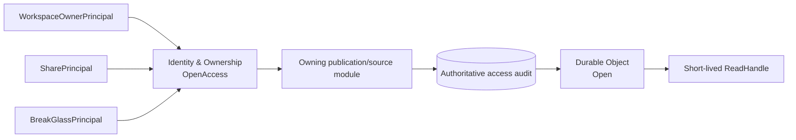

# Content Authorization and Sharing

本文记录 GitHub Issue #15 确认的 owner、Share Link 与 break-glass 内容授权契约。`CONTEXT.md` 是领域语言权威；ADR 0013、ADR 0014 与 ADR 0025 记录长期安全选择；`durable-object-storage.md` 定义授权后 verified content 的唯一读取 seam；`backup-and-recovery.md` 定义 restore 后的授权失效语义。

本设计固定 authority、互斥 principal、Share Link/Access Code lifecycle、Verification Session、限流、防信息泄漏、break-glass 双人控制、mandatory audit、内容交付、缓存、恢复和最高层测试，不选择最终 schema、HTTP path、KDF library、KMS、session store、proxy、CDN 或 audit vendor。

## Standing constraints

- 一个 User 拥有一个不可转让、不可复用的 Personal Workspace；Task 也不跨 User transfer。
- Share Link 是一个可撤销、有期限、read-only 的 grant，只暴露一个 published immutable Artifact Version，并要求独立 Access Code。
- Platform Administrator 没有隐式 User-content access。普通 metadata/recovery authority 与实际内容检查是不同 intent。
- Artifact Version 长期保留，直到明确授权删除；删除或不可用会撤销其 Share Links。
- 内容 handle、path、object key、signed URL 或 SDK object 只能在 scoped authorization 与 mandatory audit 成功后产生。
- 所有 pre-incident Share Links、Access Codes、Verification Sessions 与 BreakGlass Grants 在 restore 后保持无效。

## Mutual-exclusive authority paths

每个内容请求必须从封闭的 `RequestPrincipal` tagged union 中选择恰好一个 variant：

```text
WorkspaceOwnerPrincipal
  UserID, PersonalWorkspaceID, AuthorizationGeneration

SharePrincipal
  ShareGrantID, ArtifactVersionID, GrantGeneration,
  WorkspaceShareGeneration, RecoveryEpoch, VerificationSessionID

BreakGlassPrincipal
  RequesterAdministratorID, ApproverAdministratorID,
  BreakGlassGrantID, exact target, closed intent,
  requester/approver generations, expires-at
```

`AdministratorPrincipal` 不是第四条内容路径。它只允许 metadata projection、identity recovery、safe rescheduling、recovery control、abnormal Share Link revocation 和其他不暴露 User content 的 administrator intents。



- 同一人同时是 User 与 Platform Administrator 时，也必须为本次 request 明确选择 owner 或 administrator/break-glass mode；不得合并 grants 取得权限并集。
- SharePrincipal 没有 UserID 或 PersonalWorkspaceID，不能访问 Task、events、Source Material、manual edit、owner metadata 或其他 Artifact Version。
- BreakGlassPrincipal 不复用 owner repository、不 impersonate User，也不授予 mutation、manual edit、Share Link management、raw object listing 或任意 Workspace browse。
- Owner、Share、break-glass 全部使用相同的 authorization-first content seam，但各自使用不同 scoped repository projection。

## Authority and module boundary

| Fact or action | Authoritative owner |
| --- | --- |
| User、Personal Workspace、owner/admin identity 与 authorization generation | `Identity & Ownership` |
| RequestPrincipal、typed AccessScope 与最终 authorization decision | `Identity & Ownership` |
| Share Grant、link-token verifier、Access Code revision、Verification Session 与 share rate limit | internal `Sharing` component |
| BreakGlass request、approval、grant、generation、expiry 与 revoke | internal `BreakGlass` component |
| Artifact Version membership、availability、deletion 与 publication projection | Artifact Publication |
| Source Material identity 与 membership | Task input module |
| Actual immutable bytes、integrity proof 与 `ReadHandle` | `Durable Object` |
| Mandatory authorization/access audit facts | Platform PostgreSQL authoritative records |
| Metrics、logs、traces 与 external audit delivery | Rebuildable projections |

`Sharing` 与 `BreakGlass` 位于 Platform Control Plane，并隐藏 token/verifier、session、generation、rate limit、approval 与 expiry mechanics。它们不向 handler 暴露 raw repositories。`Durable Object` 不决定 owner/share/break-glass policy，只接受已授权、精确、intent-bound 的读取请求。

代表性 interface，而非最终 method 或 wire name：

```text
Sharing.Decide(
  CreateGrant | ShortenGrant | RotateAccessCode |
  RevokeGrant | VerifyAccessCode | RevokeAbnormalGrant
) -> ShareDecision

BreakGlass.Decide(
  Request | Approve | Deny | Withdraw | Revoke | Use
) -> BreakGlassDecision

IdentityAndOwnership.OpenAccess(RequestPrincipal, ContentReadIntent)
  -> typed AuthorizedReadIntent | non-leaking denial

DurableObject.Open(AuthorizedReadIntent)
  -> short-lived ReadHandle | unavailable/integrity failure
```

## Share Grant identity and lifecycle

一个 Artifact Version 可以拥有多个彼此独立的 Share Grants。每个 grant 可代表不同 recipient channel、expiry、code generation 和 audit history；一个 grant 的撤销不影响同版本其他 grants。

Grant 创建时固定：

- opaque ShareGrantID；
- owning Personal Workspace relationship 和 exact ArtifactVersionID；
- immutable issued-at、expires-at 与 policy version；
- link-token keyed digest；
- current Access Code revision 和 verifier；
- Grant Generation、Workspace Share Generation 与 Recovery Epoch；
- owner creation intent、idempotency identity 和 authoritative audit identity。

有效期策略：

- default lifetime 为七天；
- platform hard maximum 为三十天；
- deployment administrator只能设置更短的 maximum；
- Owner 可在创建时选择不超过 effective maximum 的 expiry，也可缩短或撤销；
- 已签发 grant 不允许延长。继续分享必须创建新 Share Link。

Grant 状态为：

```text
Active
  -> Revoked
  -> Expired
  -> TargetUnavailable
  -> WorkspaceInvalidated
  -> RecoveryInvalidated
```

所有终态均不可复活。Expiry 使用 authoritative database time 在每次 authorization 时计算；sweeper延迟不会延长授权。Artifact Version 删除或失去可信 availability、User disable、identity rebind、Personal Workspace purge 或 Recovery Epoch推进会终止相关 grants。Reactivate、exact byte repair 或 restore 不恢复旧链接。

Owner 可以创建、列出、缩短、rotate code 和撤销自己 Workspace 的 grants。Platform Administrator只能通过独立 metadata intent撤销异常 grant；不能查看 token/code、替换 Access Code、延长 expiry 或借此读取内容。

Artifact Version deletion在 authoritative transition 中先使所有 grants terminal，再解除 durable references。跨 module work可由同一 PostgreSQL transaction和idempotent outbox协调；任何 reconciliation都不得因为旧 bytes仍存在而恢复 grant。

## Link token and Access Code

- Link token使用至少256-bit CSPRNG secret。数据库只保存KMS-keyed lookup digest，不保存明文或可逆密文。
- Access Code使用至少60-bit、适合分渠道传递的随机 secret。具体alphabet和presentation属于implementation，但不得降低entropy。
- Access Code只通过TLS-protected response显示一次，只能进入verification POST body；不得进入URL、query、Referer、log、trace、metric、exception或analytics。
- 数据库只保留独立salt、memory-hard verifier、算法/参数version和KMS-held pepper reference。Unknown token使用同成本dummy verifier path。
- Link token不支持原地rotation；需要新URL时撤销旧grant并创建新grant。
- Access Code rotation在一个transaction中替换verifier、推进Grant Generation、提交audit并使所有旧code和Verification Sessions失效。它不改变URL或expiry。
- 被替换verifier在commit后立即不可用并移除；terminal grant的active verifier最迟24小时内移除。

Create/rotation使用scope-bound idempotency key和canonical intent digest。Same key/same payload返回原authoritative metadata；same key/different payload为typed conflict。Secret仅返回一次：response在commit后丢失时，retry不得从数据库恢复secret。Rotation response丢失时Owner再次rotate；create response丢失时Owner撤销不可用grant并创建新grant。

## Access Code verification and Verification Session

验证成功后签发服务器端Verification Session：

- browser仅持有随机opaque cookie；server保存其keyed digest；
- cookie必须为`Secure`、`HttpOnly`、`SameSite=Strict`并path-scope到share route；
- idle TTL为15分钟，absolute TTL为60分钟，且不得超过Share Grant expiry；
- session绑定ShareGrantID、ArtifactVersionID、Grant Generation、Workspace Share Generation、Recovery Epoch和policy version；
- activity可在absolute bound内更新idle expiry，但不能renew grant；
- 成功后立即redirect到不含link token的session URL，并设置`Referrer-Policy: no-referrer`；
- session页面不得加载第三方subresources。

每个新的publication projection、Artifact member download、inline view或Range request都重新验证当前grant status、expiry、generations、target availability和Recovery Epoch。Session不能换取WorkspaceOwnerPrincipal、Task scope、通用download token或长期signed URL。

已经成功打开且mandatory audit已提交的immutable stream不因随后rotation、revoke、disable或expiry而截断；所有新handle和新的Range request立即fail closed。已披露bytes不伪装成可收回。

## Rate limiting and abuse handling

Verification在执行memory-hard verifier前先通过分布式、持久或等价fail-closed的rate-limit seam。它同时使用三个KMS-keyed、不可逆的buckets：

| Bucket | V1 default |
| --- | --- |
| `(link-token fingerprint, client-network bucket)` | 15分钟内5次失败，随后1/2/4/8/15分钟指数退避 |
| link-token fingerprint across sources | 每小时25次失败后冷却30分钟 |
| client-network bucket across candidate links | 15分钟内100次失败后冷却30分钟 |

Deployment可以收紧这些值；关闭或放宽需要新的安全决策。Success不能清除grant-wide或network-wide abuse history。Rate-limit authority不可用时不执行verification，不降级到local in-memory unlimited attempts。

V1不使用永久account lockout，也不允许匿名攻击者触发自动永久revoke。已有Verification Sessions不因匿名失败计数被终止；Owner和Platform Administrator获得异常projection后可以显式撤销grant。

过量请求在bucket级聚合first/last/count/result，避免攻击者以per-packet audit rows耗尽数据库。Accepted verification attempts和所有successful verification仍保留独立authoritative facts。

## Non-leaking public behavior

在verification成功前，invalid token、wrong code、expired、revoked、deleted target、disabled Workspace、corrupt grant、integrity failure和authorization mismatch统一返回generic unavailable/invalid结果：

- 不返回Artifact name、Artifact Version、owner、Task、Personal Workspace、grant state或存在性；
- existing与unknown candidate经过相同rate-limit dimensions、dummy KDF cost、response class和bounded response shape；
- `429`仅由对existing与unknown candidates相同的bucket policy触发；
- raw identifier、verifier、rate-limit key和internal error永不进入response；
- success后只返回该Artifact Version的publication-safe member projection。

Owner或authorized internal diagnostics可以获得typed denial、conflict、integrity和retryable failure；Share path始终使用更窄的non-leaking projection。

## Break-glass lifecycle and dual control

Break-glass采用双人控制。Requester和approver必须是两个不同、当前有效的Platform Administrators，并分别提供十五分钟内的企业authentication freshness。SlideSmith不自行实现普通User密码或MFA；authentication strength仍由企业sign-in policy负责。

Request必须绑定：

- opaque request/grant identity；
- requester administrator及其authorization generation；
- reason code、非空说明和incident/ticket reference；
- exact target或canonical exact target set；
- closed read/inspection intent；
- requested duration、policy version和data-minimization assertion；
- created-at、approval deadline和idempotency identity。

状态为：

```text
Requested -> Approved -> Active -> Revoked | Expired
    |            |          \-> Consumed  # one-shot export acceptance
    |            \-> Expired
    -> Denied | Withdrawn | Expired
```

- 未批准request在24小时后失效。
- Active grant默认30分钟，hard maximum为60分钟，不续期；继续检查必须重新申请和批准。
- Self-approval禁止。Requester/approver/target/admin grant/authorization generation/expiry任一失效都会阻止新uses。
- Approval transaction是grant activation linearization point；expiry不依赖sweeper。
- Revoke立即阻止新uses和新ReadHandles，但不截断已linearize的immutable stream。

允许的closed intents只有：

- 读取一个精确Source Material、Artifact Version或明确Artifact members，用于support/recovery inspection；
- 接受一次针对disabled Personal Workspace的`PrepareWorkspaceExport` intent。

后一项只允许Issue #25的export module创建generation-fenced machine operation。它不给requester或approver交互式浏览整个Workspace的能力，也不把export attempt、HTTP response start、partial delivery或missing receipt提升为purge authority。

Break-glass不授予Task/Workspace mutation、manual edit、Share Link管理、owner session、raw repository、object listing、path/locator、arbitrary query或purge。Recovery、identity rebind、machine restore和safe rescheduling继续使用non-content administrator/machine intents。

Break-glass activation和每次use必须向independent security/audit projection发出即时告警。V1不承诺自动向User发送通知；企业可在不扩大访问authority的前提下增加通知policy。

## Content-read sequence and linearization

每次content read遵循：

1. request adapter解析恰好一个RequestPrincipal variant；
2. `Identity & Ownership`验证principal、current generations、status、expiry和intent；
3. owner/share/break-glass专用projection解析exact Source Material或Artifact Version member；
4. authoritative read-authorization与mandatory access audit提交；
5. `Durable Object`验证receipt-bound immutable generation并激活single-object、intent-bound `ReadHandle`；
6. HTTP/runtime/export adapter经handle stream或materialize；
7. completion/partial/failure evidence更新audit projection，但不能改写authorization decision。

Content-read linearization point是mandatory audit已提交且`ReadHandle`成功激活。Handle打开失败会保留failed/unavailable audit result而不暴露bytes。Audit authority、grant state、rate-limit state、generation、target membership或integrity proof不可用时，新verification和新content reads fail closed。

## Content delivery, active formats, and cache constraints

- Authorization后的responses使用`Cache-Control: private, no-store`、适当`Vary`、`X-Content-Type-Options: nosniff`和non-leaking filenames。
- V1使用authorization-aware proxy delivery，不允许origin-blind CDN、public shared cache或不能即时fence的signed URL。
- Durable Object和execution-node caches可以保存已验证immutable bytes，但cache presence从不构成authorization；每个新handle重新授权。
- Positive authorization cache不能只靠TTL。它必须证明current generation/revocation fence至少与authoritative decision一样新；不能证明时fail closed。
- HTML、SVG和其他active formats默认attachment。只有通过显式content-policy acceptance的format才能inline；未来active inline必须位于不接收owner/share/admin cookies的isolated origin或strict sandbox。
- Share Link landing、verification和session responses不得包含third-party trackers或把token放入browser history after verification。
- Range request是新的content-read intent，不能复用旧CDN cache或过期handle绕过revocation。

## Mandatory audit and privacy

以下操作产生authoritative audit facts：

- Share create、shorten、rotate、revoke、expiry/target/workspace/recovery invalidation；
- accepted Access Code verification、failure aggregation、rate-limit disposition和Verification Session creation/expiry；
- owner/share/break-glass content-handle open及completion/partial/failure evidence；
- BreakGlass request、approve、deny、withdraw、activate、use、revoke、expire/consume；
- Platform Administrator abnormal-grant revocation；
- restore epoch advance和old-grant suppression。

Create、rotation、successful verification、ReadHandle activation和break-glass use若不能提交mandatory audit则fail closed。External audit sink、metrics、logs或traces失败不会回滚已提交的authoritative fact，而形成可重试outbox/backlog。

Audit facts可以包含principal/grant/request/session audit identity、exact business target identity、intent、policy/generation、actor、approver、reason、time、result、rate-limit disposition和opaque handle/evidence identity。它们不得包含link token、Access Code、salted verifier、cookie/session secret、User content、object locator、unbounded request body、raw URL或credential。

普通business audit只保存KMS-keyed pseudonymous network bucket。若security adapter保留exact network evidence，它必须独立加密、限制访问并遵守failure-evidence retention。

V1 retention baseline：

| Record | Minimum/maximum retention |
| --- | --- |
| Share lifecycle、successful verification/content-open、all break-glass facts | event或target terminal/purge后至少365天，以较晚者为准 |
| Access Code failure/abuse facts | 90天 |
| Exact restricted network evidence, if collected | 最多90天 |
| Rate-limit operational buckets | last event后最多24小时 |
| Expired Verification Session state | expiry后最多24小时 |

Workspace Export/Purge保留required authoritative audit facts而不保留content。Locked backups可能在35天Recovery Point窗口中包含encrypted verifier residue；Recovery Epoch和suppression facts保证它们不能重新授权。

## Concurrency, retry, crash, and revocation semantics

- Share lifecycle、break-glass lifecycle和audit使用scope-bound idempotency identity与canonical intent digest。
- State/generation mutation使用CAS或locking；stale owner、administrator、session、approver、worker或reconciler不能覆盖新decision。
- Share create、rotation、revoke、target invalidation、break-glass approval/revoke的linearization point是包含authoritative audit和outbox的PostgreSQL commit。
- Response在commit后丢失时，idempotent retry返回authoritative non-secret result；不会创建第二个grant或approval。
- Expiry由read-time check强制；crashed sweeper不能延长access。
- Revocation与target deletion先fence新handles，再异步投递projection/cache invalidation。TTL-only cache不能作为fence。
- Database、KMS/verifier、rate-limit或audit authority不可用时新access fail closed；已linearize stream保持其immutable delivery semantics。
- Missing/corrupt/partial/duplicated grant、session、verifier或target记录不能从log、token、bucket listing、object path或cache重建。

## Backup, restore, retention, and exact repair

Share configuration、grant lifecycle、break-glass history、mandatory audit和suppression facts属于Platform PostgreSQL business records并进入joint Recovery Point。Plaintext token、code和session secret不进入backup。

Restore在fresh environment推进Recovery Epoch以及owner/admin authorization generations。每个ShareGrant和BreakGlassGrant都绑定issued epoch，因此selected database point中的pre-incident `Active` row也保持无效。ReadOnlyReady只允许freshly authenticated owner读取verified publications；Share Link creation属于mutation，只能在FullReady后恢复。

Old grant不能通过重新写入verifier、修改expected generation或从audit/log猜测secret来repair。Corrupt grant或verifier只能恢复完全匹配original authority和immutable evidence的记录；即使exact repair成功，pre-incident epoch仍阻止其授权。Owner必须创建新Share Link，administrator必须创建新BreakGlass request。

## Highest-level scenarios and adapter contracts

`Identity & Ownership.OpenAccess`、`Sharing.Decide`和`BreakGlass.Decide`是最高层authorization test seams。Deterministic scenario suite至少覆盖：

- owner/share/break-glass互斥、forged principal、authority union和administrator impersonation；
- 多grants、create replay、secret-response loss、shorten、rotation、revoke与expiry boundaries；
- wrong/unknown token和code的KDF、rate-limit、timing和response-shape equivalence；
- session replay、cookie scope、idle/absolute expiry、Range request和stale generations；
- User disable/reactivate、identity rebind、Artifact deletion/unavailability/exact repair和Workspace purge；
- restore epoch、read-only recovery gate和pre-incident credential non-resurrection；
- revoke/expire在ReadHandle activation前后并发发生；
- authorization cache、proxy、CDN、signed URL和active-content bypass attempts；
- break-glass self-approval、duplicate/stale approval、requester/approver role loss、expiry、revoke和one-shot export acceptance；
- audit/database/KMS/rate-limit outage、external sink backlog、partial stream、crash和response loss；
- audit/log/trace/metric/HTTP headers中不存在secret、content或locator。

Production、in-memory fault-injection、HTTP/session、KDF/KMS、rate-limit、PostgreSQL、audit和owned-transport adapters共享contract where applicable。Tests断言identities、states、generations、decisions、audit facts、handles和non-leakage，而不是schema、cookie library、SQL、vendor endpoint或log text。

## Hard cutover and deletion test

当前实现没有User、Personal Workspace、Share Grant或authorization middleware；global `/api` routes只凭Task ID访问Artifact Version和content，repository提供raw global `GetByID`，handler通过`Storage.Path()`和`ctx.File()`直接交付bytes。

实施必须replace-not-layer：

- owner route group只接受WorkspaceOwnerPrincipal和owner-scoped application interfaces；
- share route group只接受link/code/session flow和SharedArtifactVersionScope；
- administrator metadata与break-glass route/interface分离；
- repository query把scope predicate放进实际query/transaction，禁止先global Get再caller check；
- content delivery删除handler对path、object key、signed URL和raw file的直接依赖；
- legacy global download/content routes、optional auth facade和path compatibility interface被删除，不在外层包裹。

本decision ticket不修改产品代码、schema或migration。Issue #17负责record-level cutover；legacy records不得fabricate owner、Share Grant、Access Code、audit或authorization history。

## Rejected alternatives and downstream inputs

Rejected alternatives包括永久或可无限延期Share Link、一个secret同时充当link和code、plaintext/recoverable Access Code、通用role/principal权限并集、permanent lockout、只按IP限流、verification前泄漏metadata、长期download bearer token、origin-blind CDN、TTL-only revocation cache、administrator self-approval、administrator owner impersonation、break-glass mutation、恢复旧sharing credentials以及把logs当audit authority。

Stable downstream inputs：

- Issue #13获得grant/session/generation、rate-limit、verification、content-open、break-glass、audit backlog、privacy和authoritative-vs-projection facts。
- Issue #25获得dual-control BreakGlass Grant、one-shot `PrepareWorkspaceExport`、no interactive Workspace browsing和separate purge authorization。
- Issue #17获得owner-scoped repository/content hard cutover以及禁止fabricate legacy grants的约束。
- Backup & Recovery获得Recovery Epoch、all-old-grants-invalid和FullReady-before-new-sharing constraints。

Superseded decisions：none。

New decision-only tickets：none。

Remaining fog affecting the first implementation SPEC：none。最终schema、wire names、KDF/KMS/session/rate-limit vendors、HTTP paths、safe-inline MIME allowlist和deployment topology属于implementation或adapter acceptance，只能在不弱化上述authority、policy values和fail-closed invariants的前提下选择。
