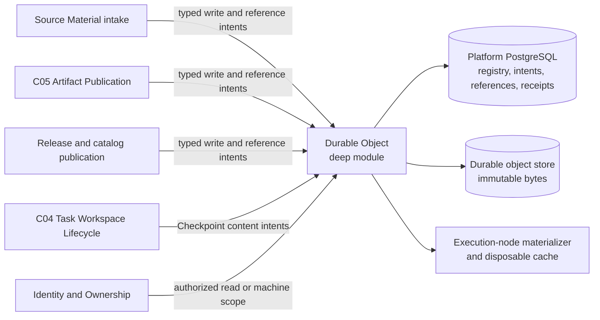

# Durable Object Storage

This document records the durable-object decisions confirmed while resolving GitHub issue 21. [CONTEXT.md](../../CONTEXT.md) is authoritative for domain language, [ADR 0017](../adr/0017-manage-durable-bytes-through-an-opaque-object-seam.md) records the object seam, [ADR 0018](../adr/0018-export-and-purge-disabled-user-workspaces.md) records the no-transfer rule, and [task-workspace-lifecycle.md](./task-workspace-lifecycle.md) remains authoritative for C04 lifecycle semantics.

The design deliberately fixes authority, invariants, and test seams without choosing an S3-compatible vendor, object-key layout, SDK, schema, or final language-level method names.

## Compound authority

Durable content is a compound fact:

- PostgreSQL is authoritative for what should exist: business identity, semantic metadata, ownership relationship, write intent, typed content reference, lifecycle state, retention intent, verification receipt, and reclamation eligibility.
- The durable store is authoritative for the actual bytes at one or more immutable adapter-private physical generations.
- A business object may activate, open, or materialize only when the PostgreSQL facts and verified bytes agree.

A PostgreSQL row does not prove that bytes exist. A bucket listing, object key, prefix, object-store manifest, ETag, or storage metadata does not prove business ownership, publication membership, retention, or authorization. Missing content, digest mismatch, or failed durable acknowledgement fails closed.

## Module and seam



`Durable Object` is a shared internal deep module and the only seam through which ordinary object payloads are prepared, attached, opened, materialized, released, reconciled, and reclaimed. It owns the technical protocol and hides:

- bucket, object key, prefix, mount, host path, vendor, SDK, credential, replica, and physical generation details;
- multipart upload, checksum negotiation, readback verification, staging residue, quarantine, and physical deletion;
- local filesystem layout, cache directories, temporary filenames, and node-specific accounting implementation.

The module does not own the semantic lifecycle of Source Material, Artifact Versions, Runtime Releases, Template Versions, Resource Bundles, or Checkpoints. Their owning modules decide whether a typed reference may be attached or detached. C04 continues to own Checkpoint integrity, reference, deduplication, retention, and reclamation semantics; `Durable Object` supplies the common verified-content mechanism used to implement them.

The authoritative durable-object registry, write intents, verification receipts, typed references, durable leases, reclamation facts, and Cleanup Debt use the same Platform PostgreSQL authority as their owning business metadata. They can therefore activate in the same transaction without a second metadata database or cross-database two-phase commit. Workers and execution nodes use an owned transport adapter and never write registry tables directly.

## Identity and deduplication

Business identity and content identity are separate:

- Source Material, Artifact, Artifact Version, Checkpoint, Runtime Release, Template Version, and Resource Bundle retain identities defined by their owning modules.
- `ContentID` is opaque and cannot be parsed into a locator or authority claim.
- Digest algorithm, digest, and byte size are immutable integrity facts and deduplication inputs, not business identities.
- Equal bytes may back several independent business objects and references. Removing one reference never changes the others.

Deduplication is policy-scoped. User content uses its Personal Workspace as the deduplication domain and never deduplicates across Personal Workspaces. Platform-published packages use a separate platform domain. A digest match never discloses another domain's object existence, timing, reference count, or retention state. Implementations may use `(domain, digest, size)` internally, but this key does not cross the interface.

## Durable-byte authority and retention matrix

| Durable bytes | Semantic and reference authority | Retention authority |
| --- | --- | --- |
| Source Material | Task input module; immutable `SourceMaterialID` references opaque content | Retained with the Task by default; explicit Task or Personal Workspace purge detaches it only after recovery dependencies are removed |
| Artifact Version member | C05; immutable Artifact identity and location-independent Artifact Version membership | Retained with its Artifact Version; explicit version deletion or Workspace purge revokes Share Links and detaches member references |
| Template Version package | Catalog publication; canonical package manifest and package content | Retained while the version is published or deprecated or any Task Template Lock depends on it |
| Resource Bundle | Catalog publication; immutable bundle manifest and package content | Retained while any Template Version, Task lock, or applicable license policy depends on it |
| Runtime Release supplementary package | Release publication | Retained while the Runtime Release or any Task release lock depends on it |
| Runtime Image | Runtime Release metadata pins an immutable OCI digest | The container registry remains the byte carrier and has a separate adapter, inventory, and backup seam |
| Checkpoint content | C04; Checkpoint content graph and explicit typed payload references | Retained by current recovery reachability, explicit references, and C04 policy |
| Workspace Export archive | Audited export intent and expiring staging lease | Removed after verified external delivery or intent expiry; SlideSmith retains only manifest digest, receipt, tombstone, and audit facts |
| Unactivated staging payload | Durable-object write intent | Removed after abort, expiry, or reconciliation proves it unreferenced |
| Local materialization and cache | C04 lifecycle intent, active leases, and node materializer evidence | Disposable whenever no lease protects it and eviction policy permits reclamation |

Source Material is not an Artifact with an empty publication version. Each upload receives an immutable `SourceMaterialID`; replacement creates a new identity rather than overwriting bytes. A Fill Template remains Source Material. Derived source analysis becomes declared Checkpoint state or an Artifact Version member according to its purpose, not another implicit Source Material object.

An Artifact Version's authoritative manifest is represented by PostgreSQL membership and a canonical digest over stable semantic and content facts. It includes member identity, kind, name, media type, size, and digest, but excludes object keys, prefixes, paths, vendors, and materialization locations. An exported manifest file may provide evidence but cannot reconstruct publication authority.

Template Versions and Resource Bundles use a canonical manifest plus a deterministic immutable package archive as the object-store materialization unit. The manifest lists safe logical paths, file types, sizes, and digests. Independently delivered preview assets may have their own typed references but remain explicit Template Version members. Runtime Images are not repackaged into this byte-stream interface.

A Checkpoint uses PostgreSQL-authoritative Checkpoint and Task Workspace Revision metadata, a canonical declared-state manifest, and explicit payload references. The manifest describes recoverable logical paths, file types, modes, sizes, digests, and opaque content identities. It is itself a verified immutable payload. C04 may deduplicate files or chunks, but restore never scans a workspace, session, bucket prefix, or modification time.

## Small caller interface

Representative capabilities, not final method names:

```text
Prepare(WriteIntent, ByteSource)
  -> expiring VerifiedContentCapability | failure

Attach(VerifiedContentCapability, typed ReferenceIntent)
  -> ContentEvidence | conflict/failure

Open(AuthorizedReadIntent)
  -> ReadHandle | unavailable/integrity failure

Acquire(MaterializationIntent)
  -> MaterializationLease | resource/integrity failure

Release(LeaseOrReferenceIntent)
  -> result
```

`Prepare` hides intent persistence, upload, digest and size computation, durable acknowledgement, and verification. `Attach` is available only to an owning module within its authoritative PostgreSQL activation transaction; ordinary callers cannot construct reference owners. `Release` expresses a typed reference or lease transition and never means physical delete.

Abort, retry, quarantine, reconciliation, replica placement, cache layout, inventory scans, and garbage collection remain internal implementation. Backup and integrity administration use a separate restricted internal interface rather than adding list or locator methods to the ordinary caller interface.

## Write, activation, and crash reconciliation

PostgreSQL and an object store do not share a distributed transaction. Every write follows an idempotent intent protocol:

1. The owning module creates a PostgreSQL `staging` intent with an idempotency key, owner, policy domain, expected purpose, and expiry.
2. `Durable Object` writes bytes to a unique adapter-private staging or content-addressed location while independently computing digest and size.
3. The adapter obtains and persists a strict `DurabilityReceipt`. Only then may the intent become `verified`.
4. The owning module uses one PostgreSQL transaction to create immutable business metadata, the canonical manifest or membership, typed references, and the active business state.
5. A retry with the same idempotency identity returns the committed result after a lost response. An unactivated verified payload remains inaccessible staging residue until retry, abort, expiry, or reconciliation.

The module never activates a business object merely because bytes exist. Its reconciler owns technical staging, receipt, lease, residue, quarantine, and physical-replica state. Source Material intake, C05, release/catalog publication, and C04 remain responsible for replaying or aborting their business intents. Reconciliation uses durable intent records rather than bucket or directory scanning.

Physical payloads are write-once. A verified generation cannot be overwritten, truncated, or reused for a partial write. Concurrent equal writes in the same policy domain may converge only after both the existing payload and the candidate facts are verified. Repair writes a new verified physical generation and atomically changes the private replica mapping; it does not overwrite the old generation or change the immutable content digest.

## Durability and verified reads

A `DurabilityReceipt` binds at least the write intent, opaque content identity, policy domain, digest algorithm, digest, size, immutable backend generation, verification method, adapter identity, and verification time.

- Application code independently computes digest and size while writing.
- A backend end-to-end checksum must match the application digest.
- Multipart ETag, modification time, filename, close success, or a generic successful response is not a checksum.
- A backend without trustworthy end-to-end checksum support requires independent readback and hashing before verification.
- A local filesystem adapter writes a temporary file, synchronizes file and parent directory, promotes atomically, and reopens for verification.
- Cancellation, partial write, receipt persistence failure, or acknowledgement uncertainty leaves the intent unverified.

Unverified bytes never flow to a User or runtime. `Open` first checks the receipt-bound immutable generation, size, and trustworthy backend checksum. When the backend cannot provide this proof, the module downloads to a temporary materialization, hashes the full payload, atomically promotes it to a verified entry, and only then opens it. Range reads are served only from a previously verified immutable object or materialization.

## Authorization and content delivery

Content access follows one order:

1. `Identity & Ownership` validates exactly one owner, Share Link, or break-glass authority path and issues a typed scope.
2. The owning module resolves the exact Source Material or Artifact Version member within that scope.
3. Required authorization and access audit facts commit successfully.
4. `Durable Object` opens a short-lived, single-object, intent-bound `ReadHandle`.
5. The HTTP or runtime adapter streams or materializes through that handle.

No content handle, path, object key, signed URL, or SDK object exists before authorization. A successfully opened immutable stream whose mandatory audit has committed is not truncated by a later disable or revocation, but every new handle must reauthorize. A future CDN or short-lived signed-delivery implementation must remain an adapter behind the same handle contract.

Sandbox processes never receive object-store credentials. An execution-node materializer alone may use a short-lived machine capability bound to the Task, Personal Workspace, ownership generation, Runtime Run or C04 operation, exact content intents, and expiry. Error results are typed and non-leaking: authorization mismatch and inaccessible identity do not reveal cross-Workspace existence; integrity failure, unavailable content, conflict, resource exhaustion, and retryable transport failure remain distinct for authorized internal callers. No error permits an unverified or path-based fallback.

## Materialization and cache

The Platform Control Plane and business modules pass opaque identities and materialization intent, never node paths. The execution-node materializer downloads and verifies content, then returns `MaterializationID`, digest evidence, state, and lease expiry. Only the final Runtime Execution adapter maps that identity to a controlled sandbox mount or logical path. A runtime-visible path is not a durable identity or recovery fact.

Raw cache keys include policy domain, digest algorithm, digest, size, and representation version. Expanded package keys additionally include package and manifest digests, unpacker or policy version, and platform constraints.

- Downloads and extraction occur in random temporary entries on the same filesystem.
- Verification covers digest, size, manifest, file type, path traversal, symlink, and representation rules before atomic promotion.
- A verified marker is evidence-bound and writable only by the materializer; an existing path alone is never a cache hit.
- Promoted entries are read-only. Sandboxes use read-only mounts, copies, or controlled copy-on-write views and cannot mutate shared cache inodes.
- A mismatch quarantines the entry and causes new acquisition to fail closed until exact bytes are recovered and reverified.

Capacity control reserves both bytes and inodes, including temporary peak space, before materialization. Accounting distinguishes active leases, verified cache, temporary staging, quarantine, pending deletion, and Cleanup Debt. Eviction uses high and low watermarks and can select only entries without active leases or retention pins. It clears failed and expired residue before cold verified cache. Resource exhaustion prevents admission before a disk-full partial operation. C04 retains its materialization and cache reclamation authority; the node materializer executes deletion and returns byte, inode, and failure evidence.

## Retention, reclamation, and repair

Explicit typed reference records are authoritative. A mutable `ref_count` may be a projection or query optimization but cannot decide retention. Staging, active reads, materializations, and commit work use bounded leases.

A payload becomes reclaimable only when it has no valid reference, lease, or protected staging intent. Detaching the final reference immediately removes business access but places the payload in `pending_reclaim` until a non-zero configurable grace period expires. The record includes eligibility time, reason, prior reference classes, and deletion generation. The backup and recovery baseline sets a default seven-day grace period; shortening policy does not retroactively accelerate existing eligibility without explicit authorization. Physical deletion is idempotent and asynchronous; failure becomes durable Cleanup Debt rather than a false report of reclaimed capacity.

Missing or corrupt committed content creates an integrity incident and blocks new reads, materializations, and dependent activation. Repair may use an independently verified replica, backup, or controlled source only when the result exactly matches the original digest, size, and manifest facts. A different result requires a new business identity or version. The system never updates the expected digest to match corrupt bytes and never adopts an orphan found by listing the store.

Background scrub verifies retained payloads and replicas according to policy. Scrub supports early detection but does not replace the proof required for a read. Metrics, logs, and traces project authoritative intent, receipt, reference, incident, and Cleanup Debt records; telemetry failure cannot invent success or alter business facts.

## Backup and encryption seam

Backup starts from a PostgreSQL committed-reference inventory containing opaque content identity, policy domain, digest, size, immutable backend generation, reference class, and verification receipt. Object-store listing may find orphans or missing replicas but cannot define the business recovery set. Staging residue, expired leases, local cache, quarantine, and pending deletion are not business payloads; restoration lets reconciliation resolve their authoritative intents, incidents, tombstones, and Cleanup Debt.

The [backup and recovery contract](./backup-and-recovery.md) binds this inventory and its independently verified backup receipts to a PostgreSQL target in one Recovery Point. PostgreSQL and all committed referenced bytes share a 15-minute RPO and a 35-day point-in-time window. Restoration verifies the entire stage-specific payload set before its promotion gate passes. Runtime Image registry inventory and restore remain separate from ordinary object-store inventory but participate in the full-recovery manifest and gate.

Enterprise V1 requires TLS in transit and platform-managed encryption at rest for PostgreSQL, object storage, backups, and execution-node disks. At least one immutable backup copy uses an independent failure and authority domain; production credentials cannot delete it or shorten retention, and restore/decrypt requires dual control. Key identifiers, encryption metadata, KMS details, and vendor settings remain adapter-private. V1 does not use per-Personal Workspace application-level keys, but opaque policy and encryption-domain evidence leaves room to add them without changing business identities.

## Workspace Export and purge seam

SlideSmith does not transfer Tasks or Personal Workspaces between Users. An administrator who must recover a disabled User's retained work uses two separate intents:

1. Audited break-glass creates a deterministic Workspace Export manifest and an expiring archive staging payload. The manifest enumerates included Tasks, Source Material, Artifact Versions, relevant metadata, every payload digest and size, and explicit exclusions. Export completes only after an external administrative archive returns a verified delivery receipt bound to the manifest digest.
2. A separately authorized purge revalidates the Personal Workspace generation and completed export evidence before detaching retained content references. Export failure, response start, partial delivery, or missing receipt leaves the Workspace unchanged.

The export archive is neither an Artifact Version nor a backup and is not retained inside SlideSmith after successful delivery or expiry. The Personal Workspace identity is never reassigned or reused. After purge, the platform retains only the Workspace tombstone, export manifest digest, external delivery receipt, Usage Ledger history required by policy, and authoritative audit facts.

## Highest-level tests and replacement

The ordinary interface is the highest-level storage test seam. A shared black-box contract suite covers:

- idempotent prepare, verify, attach, abort, release, and response-loss recovery;
- concurrent same-domain deduplication and cross-domain isolation;
- partial write, cancellation, timeout, acknowledgement loss, multipart upload, and large objects;
- immutable generation, strict receipt, verified read, missing or corrupt payload, quarantine, and exact repair;
- explicit references, leases, grace-period eligibility, repeated reclamation, and Cleanup Debt;
- cache promotion, package extraction, poisoning, bytes and inode reservation, resource exhaustion, and eviction;
- crash injection before and after every authoritative state transition;
- absence of object key, path, bucket, mount, vendor, or credential leakage.

Adapters include a deterministic in-memory implementation for fault injection, a local filesystem implementation for development and filesystem semantics, a production object-store implementation tested against its real compatible backend, and an owned-transport implementation that preserves the same result and error semantics across processes.

Once the new interface and adapter contracts exist, replace and delete the legacy `StorageService` surface and tests that assert `Root()`, `Path()`, object-key prefixes, host layout, direct recursive deletion, caller snapshots, or storage-specific rollback. Do not wrap that surface in an optional compatibility facade.
