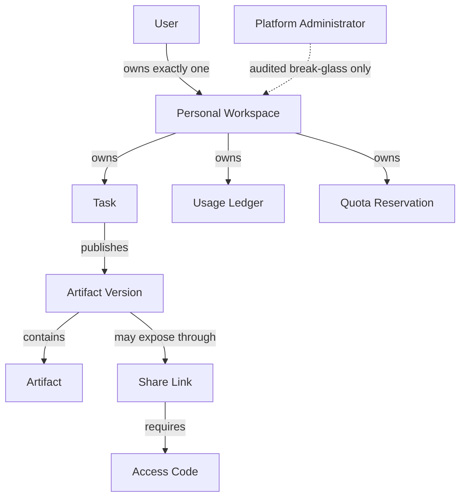
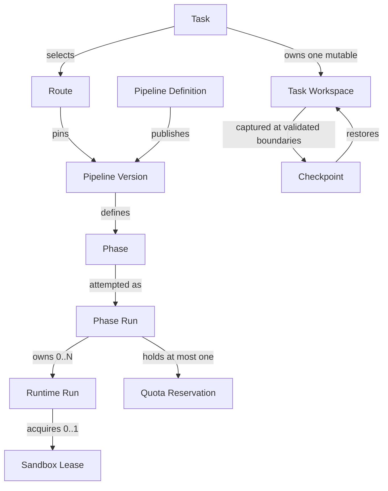
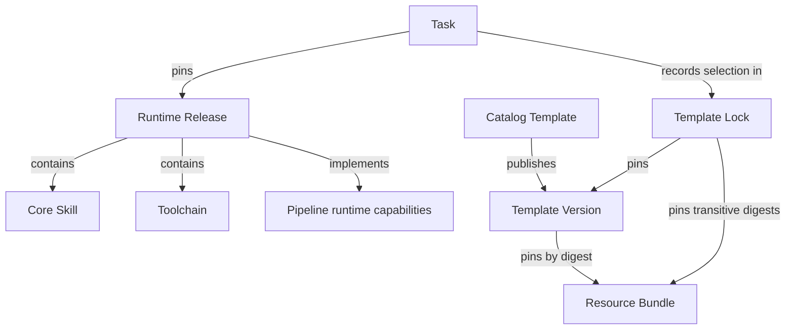

# Enterprise Platform Domain Model

This document is a relationship view of the decisions confirmed during the SlideSmith enterprise-platform architecture review. [CONTEXT.md](../../CONTEXT.md) remains the authoritative glossary, the files in [docs/adr](../adr) record durable decisions, and [enterprise-v1-scope.md](./enterprise-v1-scope.md) records first-release delivery boundaries.

## Ownership and publication

- A Share Link grants no access to its Task or Personal Workspace.
- Moving a Task does not rewrite historical Usage Ledger ownership.
- Artifact Versions are immutable publication sets; edits publish child versions.

## Pipeline and execution

- A Runtime Run cannot advance the Generation Pipeline directly; its Phase Run validates the outcome.
- Runtime Runs share explicit Task Workspace state, never hidden sandbox state.
- Each Runtime Run uses a fresh lease; infrastructure may reuse a fully reset physical sandbox under a new lease.

## Runtime and design packages

- Core Skills ship inside content-addressed Runtime Images for the first release.
- Catalog Templates and large non-executable Resource Bundles are separately versioned, read-only packages.
- No Task references a floating `latest` runtime, template, or resource package.

## Authority boundary

| Platform Control Plane | Execution Data Plane |
| --- | --- |
| Users, Personal Workspaces, and access | Sandboxed process execution |
| Tasks, Route and Pipeline locks | Task Workspace byte mutation |
| Phase Run and Runtime Run authority | Runtime status and evidence emission |
| Runtime and Template locks | Temporary logs and outputs |
| Artifact Version metadata and sharing | Sandbox allocation and cleanup |
| Usage Ledger and Quota Reservation | Measured usage receipts |

Execution output becomes authoritative only after the Platform Control Plane validates and records it.
