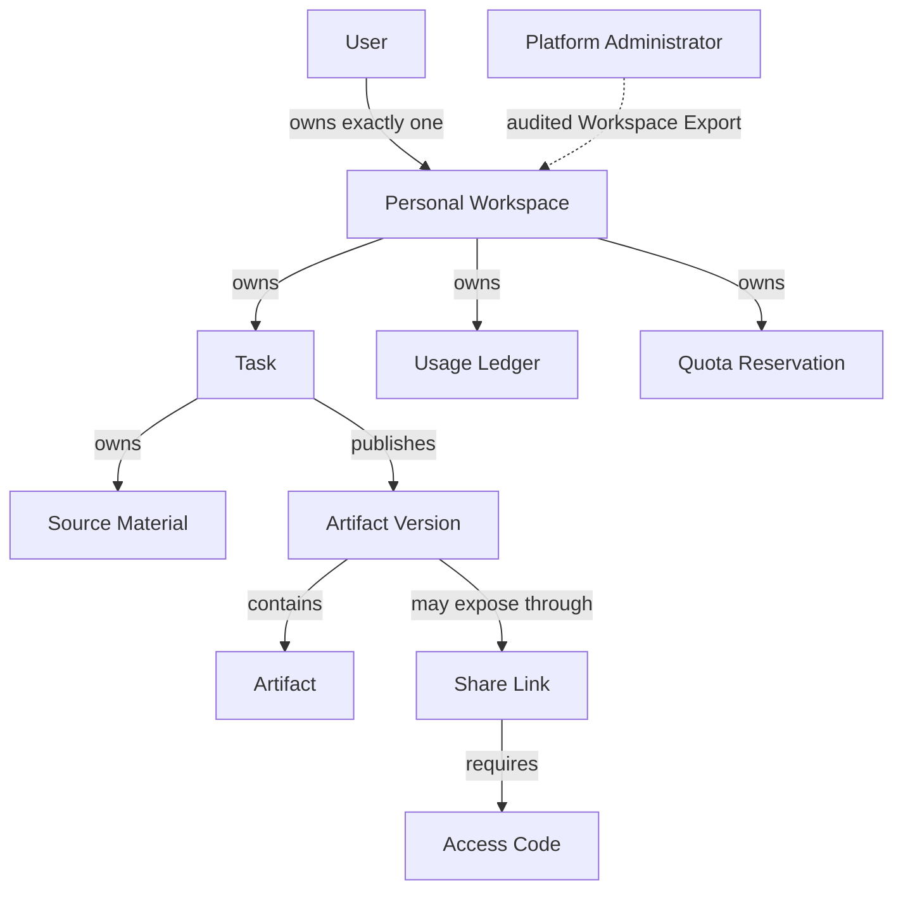
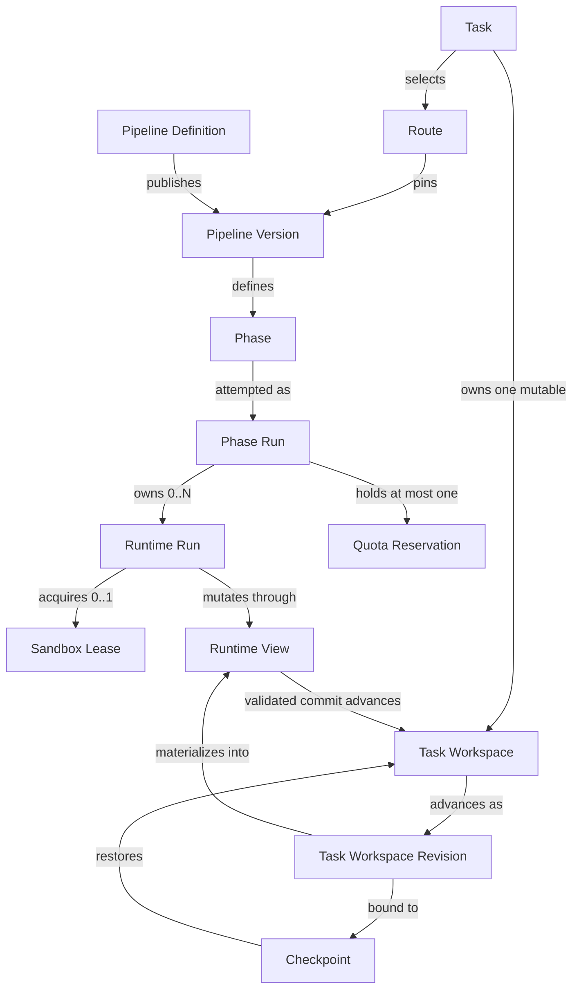
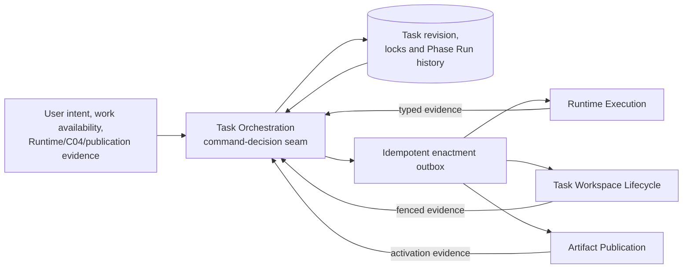
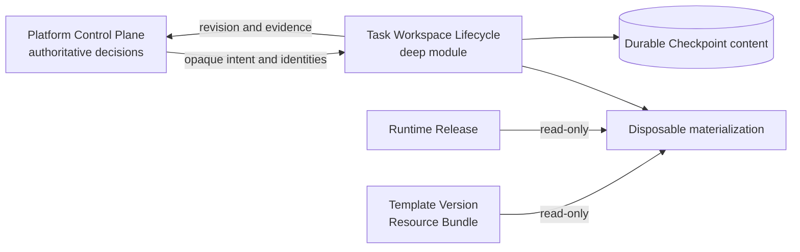
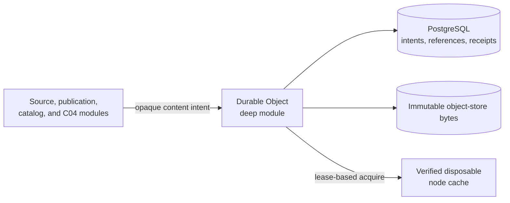
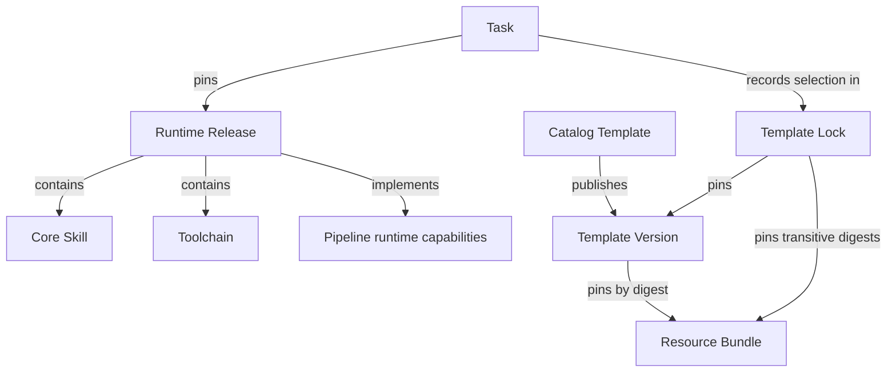

# Enterprise Platform Domain Model

This document is a relationship view of the decisions confirmed during the SlideSmith enterprise-platform architecture review. [CONTEXT.md](../../CONTEXT.md) remains the authoritative glossary, the files in [docs/adr](../adr) record durable decisions, [enterprise-v1-scope.md](./enterprise-v1-scope.md) records first-release delivery boundaries, [task-orchestration.md](./task-orchestration.md) records Task transition authority, [task-workspace-lifecycle.md](./task-workspace-lifecycle.md) records the grilled C04 lifecycle invariants, and [durable-object-storage.md](./durable-object-storage.md) records the shared durable-byte seam.

## Ownership and publication

- A Share Link grants no access to its Task or Personal Workspace.
- A Personal Workspace or Task is never transferred to another User. Audited Workspace Export and a separate purge are the only disabled-User offboarding path.
- Workspace Export or purge does not rewrite historical Usage Ledger ownership.
- Source Material is a Task-owned durable input, not an unpublished Artifact.
- Artifact Versions are immutable publication sets; edits publish child versions.

## Pipeline and execution

- A Runtime Run cannot advance the Generation Pipeline directly; its Phase Run validates the outcome.
- Runtime Runs share explicit Task Workspace state through isolated Runtime Views, never hidden sandbox state.
- Each Runtime Run uses a fresh lease; infrastructure may reuse a fully reset physical sandbox under a new lease.
- Every successful Phase Run binds its validated contract, authoritative Task Workspace Revision, and a distinct durable Checkpoint identity.

## Task Orchestration

- One authenticated or evidence-bearing `Decide` operation is the mutation seam for Task, Generation Pipeline, Confirmation Gate, Phase Run, retry, cancellation, recovery, and manual-edit progression.
- Task status is a coarse projection. The pinned Pipeline Version and Phase Run outcomes define route-specific progress; status constants and workers do not define workflow order.
- Accepted decisions and their enactments commit atomically. Claim loss or acknowledgement loss causes idempotent redelivery and reconciliation, not a new Phase Run.
- Events, audit records, and metrics are projections of accepted decisions. External events are not appended as authority before authorization and optimistic-concurrency validation.

## Task Workspace lifecycle

- The lifecycle interface exposes high-level intent and opaque identities, never host paths, mounts, file operations, storage vendors, buckets, or node details.
- One authoritative writer advances each Task Workspace; mutating Runtime Runs commit or discard transactional Runtime Views after Phase Run validation.
- A Checkpoint captures declared recoverable Task-owned mutable state, not a directory snapshot. Immutable runtime and template packages, Source Material, cache, sessions, and failed residue stay outside it.
- Checkpoint content becomes authoritative only after node-independent durable acknowledgement; missing content or digest mismatch fails closed.
- Physical materialization can expire and be rebuilt on any eligible execution node. Cleanup failures become persistent, retriable Cleanup Debt rather than untracked directories.

## Durable objects and materialization

- PostgreSQL is authoritative for semantic metadata, typed references, activation, retention intent, and verification receipts; the durable store carries the actual immutable bytes. Neither side is sufficient alone.
- Business identity remains separate from opaque content identity and digest. User content deduplicates only within its Personal Workspace policy domain.
- Cross-store writes use durable intents, strict verification, a PostgreSQL activation transaction, and idempotent reconciliation. Missing or mismatched bytes fail closed.
- Execution nodes materialize through leases and verified digest caches. Host paths, mounts, object keys, vendors, and credentials stay inside adapters.

## Runtime and design packages

- Core Skills ship inside content-addressed Runtime Images for the first release.
- Catalog Templates and large non-executable Resource Bundles are separately versioned, read-only packages.
- Runtime Images remain in an OCI registry; Template Versions and Resource Bundles use immutable object-store package payloads behind the durable-object seam.
- No Task references a floating `latest` runtime, template, or resource package.

## Authority seam

| Platform Control Plane | Execution Data Plane |
| --- | --- |
| Users, Personal Workspaces, and access | Sandboxed process execution |
| Task Orchestration decisions, Task revision, Route and Pipeline locks | Task Workspace materialization and byte mutation |
| Phase Run outcome, Runtime Run relationship, Checkpoint metadata, and commit authority | Runtime status and evidence emission |
| Runtime and Template locks, durable-object registry and references | Temporary logs and outputs |
| Artifact Version metadata and sharing | Runtime Views, Checkpoint content, expiry, and cleanup |
| Usage Ledger and Quota Reservation | Measured usage receipts |

Execution output becomes authoritative only after the Platform Control Plane validates and records it.
