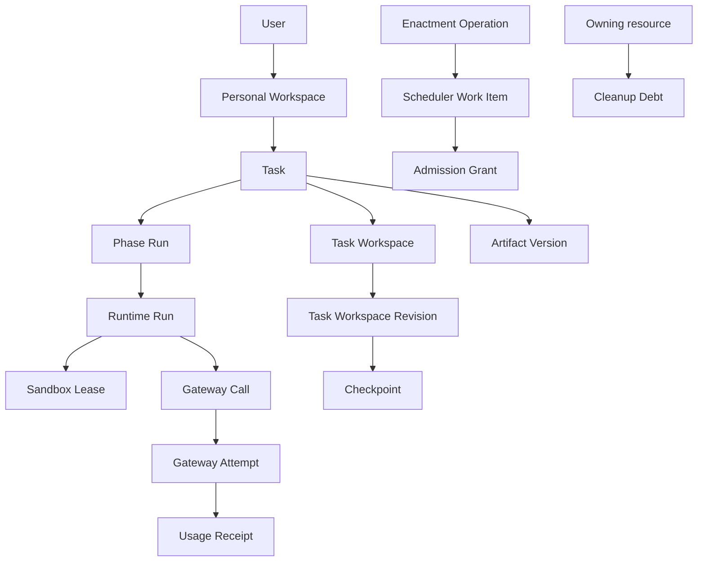

# Observability, Authoritative Audit, and Cleanup Debt

This document records the correlation, audit, metrics, tracing, structured-log,
alerting, retention, and Cleanup Debt decisions confirmed while resolving
[GitHub issue 13](https://github.com/Vt00ls/SlideSmith/issues/13).
[CONTEXT.md](../../CONTEXT.md) is authoritative for domain language,
[ADR 0027](../adr/0027-separate-authoritative-facts-from-telemetry-projections.md)
records the durable authority boundary,
[task-orchestration.md](./task-orchestration.md) defines Task and Phase Run
decision authority,
[runtime-execution.md](./runtime-execution.md) defines Runtime Run and Sandbox
Lease facts,
[task-workspace-lifecycle.md](./task-workspace-lifecycle.md) defines C04 and
Cleanup Debt ownership,
[scheduling-and-capacity-admission.md](./scheduling-and-capacity-admission.md)
defines queue and capacity facts,
[llm-gateway-and-usage-accounting.md](./llm-gateway-and-usage-accounting.md)
defines provider and usage facts, and
[content-authorization-and-sharing.md](./content-authorization-and-sharing.md)
defines mandatory access audit.

The design fixes authority, correlation and propagation, minimum signals and
alerts, Cleanup Debt observability, cardinality, redaction, access, retention,
failure, and test seams. It does not select an observability or audit vendor,
collector topology, dashboard product, schema, wire encoding, sampling
percentage, production capacity, or a new externally visible SLO.

## Decision summary

Authoritative domain facts and authoritative audit facts live in Platform
PostgreSQL under their owning Platform Control Plane modules. Metrics, traces,
structured logs, dashboards, and an external audit sink are incomplete,
expiring projections. No telemetry signal can authorize access, advance a
Task, settle usage, prove cleanup, release capacity, repair integrity, or
delete data.

An authoritative correlation graph uses immutable business, decision,
operation, generation, revision, fence, and evidence identities. A trace ID is
diagnostic context only. Lost, unsampled, or partial traces therefore never
break retry, reconciliation, audit, or recovery.

Mandatory audit is part of the protected operation's fail-closed transaction.
External audit delivery is asynchronous and rebuildable from the authoritative
audit records. Ordinary telemetry failure never rolls back a completed domain
transition.

Cleanup Debt is a durable obligation under the module that owns the resource.
It remains visible and retriable until verified cleanup succeeds or an
explicitly authorized, audited resolution closes it. A metric, directory,
bucket listing, process list, or log message can discover a candidate but can
never resolve or delete it.

## Standing constraints

- The Platform Control Plane owns business state; Execution Data Plane output
  becomes authoritative only after validation and recording.
- Task, Phase Run, Runtime Run, Sandbox Lease, Scheduler Work Item, Admission
  Grant, Gateway Call, Gateway Attempt, Usage Receipt, Checkpoint, Artifact
  Version, Share Grant, and Cleanup Debt remain distinct identities.
- C04 persists lifecycle transitions, Checkpoint integrity, and Cleanup Debt.
  Telemetry adapter failure does not roll back a completed C04 transition.
- Content access, break-glass, release and catalog publication, scheduling
  policy administration, usage correction, recovery control, and authorized
  Cleanup Debt exception require authoritative audit.
- Provider usage is settled only from verified Usage Receipts and the Usage
  Ledger. Logs, traces, metrics, provider aggregates, and Runtime outcome are
  never usage authority.
- Enterprise V1 remains single-site, uses no telemetry vendor commitment, and
  adds no external availability or latency SLO through this decision.

## Authority and projection matrix

| Information or action | Authority | Projection relationship |
| --- | --- | --- |
| Task revision, locks, Phase Run outcome, Runtime Run membership | Task Orchestration | Projects decisions, duration, failure, retry, cancellation, and reconciliation |
| Runtime state, Sandbox Lease, fence, node facts, Runtime Evidence | Runtime Execution | Projects run, lease, containment, reset, and adapter health |
| Scheduler Work Item, fairness, claim, grant, dead-letter, capacity decision | Scheduler | Projects queue, delay, admission, fairness, and saturation |
| Task Workspace Revision, Checkpoint, materialization, cleanup obligation | C04 | Projects lifecycle, integrity, storage pressure, and Cleanup Debt |
| Durable-object intent, reference, receipt, incident, reclaim eligibility | Durable Object | Projects integrity, inventory, cache, bytes, inodes, and scrub results |
| Gateway Call and Attempt, Usage Receipt issuance | LLM Gateway | Projects provider route, attempt, ambiguity, latency, and receipt delivery |
| Usage Ledger, Reservation, correction, reconciliation | Usage Accounting | Projects actual, estimate, unknown, backlog, and discrepancy health |
| Share, Verification Session, break-glass, content-read decision | Sharing, BreakGlass, Identity & Ownership | Projects non-content access and abuse signals |
| Release, catalog, compatibility, safety, and lock decisions | Release Management and Catalog Publication | Projects publication, activation, revocation, disable, and package health |
| Recovery Point, watermark, restore gate, drill result | Backup & Recovery | Projects lag, capacity, restore, and drill health |
| Actor, authority, intent, target, reason, before/after revision, result | Authoritative audit fact committed by the owning module | Projects to protected search and external audit sinks |
| Structured log, metric sample, span, dashboard, external audit copy | Observability adapter | Never authoritative; may be missing, sampled, delayed, duplicated, or expired |

An authoritative audit fact is evidence that an actor or machine authority
requested and received a decision. It references the owning domain decision;
it is not a duplicate state machine and does not replace that domain fact.

## Internal seams

Representative semantic families, not final method or wire names, are:

```text
Audit.RecordRequired(AuthoritativeTransaction, AuditIntent)
  -> AuditFactRef | fail-closed error

Telemetry.Project(FactProjectionEnvelope)
  -> idempotent projection result

Telemetry.Emit(OperationalSignal)
  -> best-effort emission result

OperationalDiagnostics.Query(AdministratorMetadataScope, DiagnosticIntent)
  -> protected, content-free diagnostic view
```

The owning module constructs the semantic decision and required audit intent.
A shared append-only audit facility supplies canonicalization, integrity,
access, retention, and delivery mechanics without taking over the decision.
The audit fact and protected mutation commit in the same PostgreSQL
transaction.

Authoritative records expose a typed projection envelope or can be scanned by
an idempotent projector. Runtime-only signals use a typed best-effort emitter.
Callers do not receive a generic label map, logger, telemetry repository, audit
table, or external sink client as a business interface.

Projection delivery uses `FactID + fact revision + projection schema` as its
idempotency identity. Duplicate or out-of-order delivery may update a
projection but cannot rewrite the source fact. A missing projection can be
rebuilt from authoritative records when those records are retained.

## Authoritative correlation model

Correlation is a typed graph, not one universal request ID:



Every authoritative fact records the subset required by its owning contract:

- `DecisionID` identifies an accepted Platform decision;
- `OperationID` identifies one idempotently replayable enactment;
- `CausationID` or an explicit relationship identifies the preceding decision
  or evidence without assuming synchronous nesting;
- business identities preserve ownership and lifecycle attribution;
- revision, generation, epoch, lease, and fence reject stale evidence;
- evidence identity and canonical digest bind the accepted proof;
- occurred, observed, recorded, and terminal times remain distinct.

The following retry rules are mandatory:

- acknowledgement or delivery loss reuses the same OperationID;
- a business retry creates a new Phase Run;
- a true execution retry creates a new Runtime Run;
- provider retry or fallback creates a new Gateway Attempt;
- Cleanup Debt retry preserves the DebtID and advances its retry generation;
- each new identity records an explicit relationship to the prior attempt.

`TraceID` and `SpanID` may be recorded as protected projection references but
are never an idempotency, ownership, settlement, or recovery key.

User identity stops at the ownership and authorization seam. Execution
capsules use Personal Workspace, Task, run, operation, lease, and fence
authority only when required. Share requests use Share Grant and Artifact
Version scope and never propagate User or Personal Workspace identity to the
recipient or browser telemetry.

## Trace propagation

Owned transports use W3C `traceparent` and `tracestate` as the vendor-neutral
wire context. W3C baggage is empty by default. Business identities,
credentials, content classifications, provider identities, paths, and secrets
travel only in authenticated typed envelopes, not baggage.

- Public HTTP ingress creates a new trusted Platform root. Untrusted caller
  trace context and baggage are discarded unless a separately approved
  enterprise ingress policy validates and rewrites them.
- A synchronous internal call may create a child span after authenticating the
  caller and extracting a valid owned context.
- A Scheduler producer records offer/enqueue work. Queue wait is measured from
  authoritative enqueue and acceptance times. Consumers create receive and
  processing spans linked to the producer rather than pretending a long,
  retried queue lifetime is one reliable parent chain.
- At-least-once redelivery links every consumer attempt to the same OperationID
  and producer context. Delivery attempts have distinct span identities.
- Remote-owned C04, Runtime, Gateway, Usage, object, and backup adapters accept
  only a bounded validated trace context and create a new internal span.
- Agent and Tool sandboxes receive sanitized trace context only when the exact
  Runtime Binding permits it. Guest spans and Agent Compose telemetry remain
  untrusted adapter evidence. Runtime Execution validates Runtime Run,
  operation, lease, fence, and evidence before linking guest observations; it
  never adopts a guest parent as authority.
- Each Gateway Call and Gateway Attempt has its own span. Provider request and
  object IDs remain protected diagnostic attributes. `X-Client-Request-Id`
  remains diagnostic and has no idempotency meaning.
- External providers receive no Task, Workspace, run, receipt, secret, or
  baggage attributes. A provider trace header or diagnostic request ID is sent
  only when its onboarded route policy explicitly permits that content-free
  field.
- The sampled flag is advisory. Each service applies the current versioned
  sampling policy, and partial traces are an expected result.

Security, integrity, break-glass, revocation, disable, recovery-gate,
dead-letter, stale-fence conflict, and Cleanup Debt creation or resolution
signals are selected for complete trace retention when telemetry is healthy.
This selection is still a projection guarantee, not an authority or
availability SLO.

## Authoritative audit contract

A required audit fact binds at least:

- audit schema, immutable AuditFactID, canonical digest, and integrity version;
- owning module, exact decision or operation, and authoritative revision;
- one mutually exclusive human, machine, Share, or break-glass authority;
- action, closed intent, target identity or exact target set, and result;
- reason code, incident or ticket reference when policy requires it;
- before and after lifecycle, generation, policy, or safety revision;
- policy, authorization, recovery, and safety epochs;
- occurred and recorded times plus source clock identity;
- evidence, approval, idempotency, retry, reconciliation, and superseding
  references;
- a content-free safe error category when the operation is denied or fails.

Audit facts are append-only. Correction or repair appends a superseding fact
and retains the original. A mutable message, external audit event ID, log
record, dashboard row, or object-store file cannot replace an AuditFactID.

Mandatory audit applies at least to:

- Share Grant and Access Code lifecycle, accepted verification, content-handle
  open, and the failure aggregation defined by the sharing contract;
- every break-glass request, approval, denial, use, revoke, expiry, and
  one-shot export acceptance;
- release, compatibility, rollout, catalog, safety, and revocation decisions;
- scheduling policy, Resource Class, concurrency, quarantine, manual capacity
  release, dead-letter resolution, and redrive;
- usage correction, cross-Workspace integrity repair, and provider evidence
  repair;
- Recovery Point and restore selection, key activation, promotion, retention
  change, drill, and incident decisions;
- authorized deletion, Workspace Export, purge, reclamation exception, and
  manual Cleanup Debt resolution;
- authorization-sensitive repair, suppression, and administrator diagnostic
  access required by an owning policy.

Audit never contains User content, prompt or response text, tool arguments or
results, Access Code, token, cookie, verifier, credential, raw URL or query,
object locator, host path, unrestricted provider error, or unbounded request
body. A content-bearing evidence object remains behind its owning module,
encryption, explicit retention, and audited break-glass seam.

## Structured logs, metrics, and traces

Structured logs describe bounded operational observations. Each event uses a
registered event name and schema, safe severity, module, operation, result,
safe error category, timestamp, and approved protected correlation fields. A
free-form message is optional display text, never a query or decision
contract. Stack traces and external errors use a restricted diagnostic field
or opaque evidence reference and do not enter ordinary logs.

Metrics are aggregated, bounded-cardinality health and capacity projections.
They report unknown or stale explicitly; an unavailable source never emits a
fabricated zero. Counters derive from immutable facts where possible. Gauges
record source watermark and collection time so a dashboard can distinguish no
work from no data.

Traces explain causal latency and adapter interaction. They are sampled,
partial, expiring, and protected. Span status is diagnostic and cannot prove a
domain terminal result. Exact business timing uses authoritative accepted and
recorded times; span clocks are not linearization authority.

## Minimum signal catalog

| Area | Minimum metrics and diagnostic signals |
| --- | --- |
| Platform and Task Orchestration | accepted/rejected decisions, optimistic conflicts, transition and Phase duration, Phase outcome, retry, cancel, evidence rejection, outbox and reconciliation count/bytes/oldest age |
| Scheduler | queue count and serialized bytes, oldest eligible age, priority and pool, watermark rejection, active Workspace count, fairness rounds and lag, admission/deferral/unschedulable category, allocation and fragmentation, claim/grant lifecycle, dead-letter/redrive, node readiness and quarantine |
| Runtime Execution | run state and terminal outcome, worker class and capability, start and terminal latency, ambiguous transport, lost/timeout/cancel, lease acquire/renew/expiry/revoke/release, stale evidence, containment/reset, node quarantine, logical and physical capacity release lag |
| C04 and Checkpoints | materialize/restore/commit/discard result and latency, Revision and Checkpoint verification, missing or mismatched content, Runtime View and materialization expiry, reclaim result, cleanup throughput, Cleanup Debt |
| Durable Object and cache | prepare/attach/open/acquire result and latency, staging and pending-reclaim age, missing/corrupt content, scrub and exact repair, active leases, cache/staging/quarantine/pending-delete/debt bytes and inodes, high/low watermark and reservation failure |
| Gateway and Usage | Calls and Attempts by safe route class and outcome, latency, fallback, ambiguity, no-send and unknown, Receipt outbox count/bytes/age, ingest/quarantine/digest conflict, Reservation state, late evidence, correction, unresolved discrepancy, reconciliation freshness |
| Sharing and security | grant lifecycle, verification success and failure aggregation, rate-limit disposition, Verification Session lifecycle, content-open result, break-glass lifecycle and use, abnormal revoke, audit backlog and suppression |
| Release and catalog | candidate, approval, activation, rollback, deprecation, revocation/disable, compatibility and selection conflict, safety-epoch rejection, scan/license/integrity failure, package materialization, retention and reclamation |
| Backup and recovery | finalized watermark age, candidate and copy lag, committed-reference counts/bytes, RPO mode, manifest/receipt/signature failure, restore state and gate, missing dependency, drill result and duration |
| Cleanup Debt | open count, estimated bytes and inodes, oldest age, creation and resolution rate, retry attempt/success/failure, next-retry lag, safe error category, owner module and resource class, blocked/quarantined state |

Metric dimensions use closed or deployment-bounded registries. Exact release,
catalog, provider route, model, node, or policy revisions remain protected
diagnostic attributes unless the registry proves the active label set stays
within the configured series budget.

## Minimum alerts

The minimum alert contract separates immediate integrity/security events from
versioned operational thresholds. Threshold defaults are internal operating
objectives, not external SLOs.

Immediate critical or security notification is required for:

- mandatory audit serialization, integrity, authorization, or persistence
  failure;
- cross-Workspace, cross-Task, receipt-digest, signature, or stale-fence
  integrity conflict that reaches an authority seam;
- missing or corrupt committed Checkpoint, Artifact, package, or durable object;
- break-glass activation and every use;
- release revocation, catalog disable, restore/decrypt activation, or recovery
  promotion;
- the recovery watermark reaching 15 minutes and the Platform entering
  `recovery-degraded/read-only`;
- loss of the reserved safety-control lane, all compatible execution capacity,
  or the ability to preserve an authoritative audit fact;
- an unauthorized cleanup or deletion attempt.

Default warning and critical thresholds are:

- Recovery Point watermark: warning at ten minutes, critical at fifteen
  minutes; the authoritative read-only transition remains the real gate.
- Queue, audit-delivery spool, and bounded projection backlog: warning at 50%
  of capacity or predicted exhaustion within 24 hours; critical at 80%, hard
  admission watermark, or loss of durable replayability.
- Cleanup Debt: emit an event on creation; warn when the oldest unresolved debt
  exceeds one hour; alert critically after 24 hours, sustained net growth, a
  configured resource-specific safety deadline, or 80% byte/inode/capacity
  pressure, whichever occurs first.
- Scheduler oldest age, provider ambiguity, unknown usage, receipt delivery,
  and reconciliation: use the versioned scheduling or onboarded provider
  deadline. Crossing the deadline never invents failure, zero usage, or a new
  business attempt.
- Node or lease loss quarantines the affected capacity immediately. It becomes
  critical when no compatible healthy pool remains or containment/reset cannot
  finish before the owning safety deadline.

Rate and latency anomaly alerts compare against a versioned baseline and a
minimum absolute count. A single low-volume percentage does not page solely
because its denominator is small. The alert records the source watermark and
whether data is complete, stale, or unknown.

## Cleanup Debt authority and lifecycle

Every resource has exactly one cleanup authority. Runtime Execution owns
process, sandbox, lease, containment, and reset cleanup. C04 owns Runtime View,
Task Workspace materialization, Checkpoint and workspace cleanup. Durable
Object owns staging, physical generations, materialization cache, quarantine,
and object reclamation mechanics. Release, catalog, publication, export, and
backup modules own their semantic references and cleanup intent.

They do not duplicate one failed resource as debt in several modules. A
downstream adapter reports evidence to the resource owner, which creates or
updates the one debt record.

A Cleanup Debt record binds at least:

- immutable DebtID, owning module, resource class, and opaque resource identity;
- protected Personal Workspace, Task, Phase Run, Runtime Run, Checkpoint,
  Artifact Version, package, node, or operation relationships when applicable;
- cleanup intent, cause decision or operation, retention and eligibility fact;
- creation, eligibility, first-attempt, last-attempt, next-retry, and resolved
  times;
- attempt count, consecutive failure count, claim generation, fence, and
  current retry disposition;
- safe last-error category and digest or restricted evidence reference;
- estimated bytes and inodes, estimation method, observation time, and
  explicit unknown state;
- lease, reference, incident, grace-period, or quarantine blocker summaries;
- final resolution class, reason, actor or machine authority, audit fact, and
  evidence root.

Representative states are `Open`, `Claimed`, `RetryScheduled`, `Blocked`, and
`Resolved`. Claim expiry returns the same debt to retry; it never creates a new
debt or proves cleanup. Retry is idempotent and uses the current owner,
generation, reference, lease, grace-period, and fence facts.

Allowed resolution classes are:

- `Reclaimed`: current authority and adapter evidence prove deletion or reset;
- `AlreadyAbsent`: the owning adapter proves the exact resource generation is
  absent and no required reference or containment fact remains;
- `RetainedByAuthority`: a newly verified reference, lease, incident, or policy
  means the resource is no longer eligible for cleanup;
- `AcceptedException`: an authorized administrator decision accepts continued
  residue for a closed reason and duration.

`AcceptedException` requires mandatory audit and never reports bytes, inodes,
or capacity as reclaimed. Expiring an exception reopens or replaces the
obligation through an explicit decision. Editing a metric, suppressing an
alert, deleting a marker, or losing a path cannot resolve debt.

The cleanup obligation or pending-reclaim fact is durable before physical
cleanup begins. If cleanup succeeds but result persistence is ambiguous, the
obligation remains and reconciliation inspects the exact generation. If
cleanup fails after a business transition committed, the transition remains
valid and the debt is durably retried.

## Orphan and integrity detection

Inventory scans compare authoritative PostgreSQL references, receipts, leases,
and intents with adapter-private byte or sandbox inventories.

- A referenced missing or corrupt resource creates an integrity incident,
  blocks dependent reads or activation, and alerts immediately.
- An unreferenced physical resource creates an `OrphanCandidate` observation,
  not ownership, deletion authority, or a business record.
- The owning module must prove stable identity, generation, absence of every
  reference and lease, grace-period completion, and no retained Recovery Point
  before turning a candidate into a cleanup intent.
- Unknown or inconsistent inventory remains quarantined. It is never adopted
  as a Checkpoint, Artifact, package, run result, or publication.
- Failed candidate reclamation becomes Cleanup Debt under the resource owner.

Orphan count and estimated bytes/inodes are metrics, but exact candidates are
visible only through protected administrator diagnostics.

## Metric cardinality contract

Every metric instrument has a registered label allowlist, label-value policy,
and maximum active-series budget. Unknown labels and values are rejected or
mapped to a bounded `other` class, and a separate cardinality-rejection counter
is emitted.

Allowed primary label families include service, site, environment, module,
operation, result, safe error category, Route, stable Phase definition key,
worker class, capability class, Resource Class, scheduling pool, priority
class, evidence state, resource class, and bounded provider family.

Primary metrics never label by User, Personal Workspace, Task, Phase Run,
Runtime Run, operation, Work Item, Delivery Claim, Admission Grant, Sandbox
Lease, Checkpoint, Artifact Version, Share Grant, Receipt, Cleanup Debt,
Execution Node, trace, span, provider request, object identity, URL, path,
locator, digest, free-form error, model string, version string, or caller input.

Exact active node, release, catalog, provider route, and model identities belong
in protected diagnostics and traces. A separate infrastructure system may use
an instance identity only under a bounded active-inventory and retention
contract; it cannot silently enlarge the primary business metric label set.

## Redaction and data classification

Telemetry emission is deny-by-default and typed. Field registries classify
values as public operational, protected metadata, restricted evidence, secret,
or User content.

The following never enter logs, metrics, traces, audit, exception aggregation,
analytics, or baggage:

- link token, Access Code, cookie, verifier, bearer token, credential, signing
  key, secret capability, or raw authorization header;
- prompt, response, reasoning, Source Material, Deck content, image, mask,
  file, tool argument or result, unbounded request body, or clipboard content;
- object key, bucket, registry credential, host or session path, mount, local
  filename, provider endpoint with secrets, raw URL/query/Referer, or arbitrary
  external error;
- a public hash of low-entropy content as a substitute for protected storage.

Opaque business and operation identities are protected metadata. They may
appear in authoritative facts and access-controlled logs or traces when
required for reconciliation, but never in metric labels, public responses,
browser analytics, or external provider propagation. General logs prefer a
short-lived keyed pseudonym when exact cross-system lookup is unnecessary.

External and guest errors are normalized to a closed safe category. Detailed
evidence uses an encrypted, access-controlled, expiring object or diagnostic
field with size limits. Redaction occurs before buffering and export, not only
at the collector. Contract tests inject known canary secrets and content and
must prove absence from every telemetry and audit adapter.

## Access and administrator diagnostics

Ordinary Users receive only product-specific safe projections explicitly
defined by an owning module. They do not receive a general audit or trace
search interface.

Platform Administrators may inspect content-free platform health and aggregate
diagnostics under `AdministratorMetadataScope`. Exact Workspace, Task, run,
grant, receipt, debt, provider-request, or node relationships require a
reason-bound protected diagnostic intent, least-privilege query scope, bounded
result, and audit of the query. Administrator metadata authority does not
permit content access or Owner impersonation.

Content-bearing provider, runtime, object, or export evidence remains behind
its exact owning scope and audited break-glass. Exact network evidence, when
collected, is separately encrypted and access-restricted under the sharing
contract.

Diagnostic views expose authoritative state, the latest projection watermark,
known missing sources, safe error category, current owner, next reconciliation
step, and evidence references. They never expose raw paths, locators,
credentials, content, or a mutation-capable repository.

## Retention

Authoritative domain and audit retention follows the owning business policy and
is never shortened by telemetry retention.

| Record or projection | Enterprise V1 baseline |
| --- | --- |
| Share lifecycle, successful verification/content-open, all break-glass facts | At least 365 days after the later of event or target terminal/purge, as already fixed by the sharing contract |
| Access Code failure and abuse facts | 90 days |
| Exact restricted network evidence, if collected | At most 90 days |
| Rate-limit operational buckets and expired Verification Session state | At most 24 hours after last event or expiry |
| Release, catalog, scheduler-policy, usage-correction, restore, purge, reclamation-exception audit | Retained with the owning business record and at least 365 days after terminal or resolution |
| Open Cleanup Debt and its retry history | Until resolved; never compacted while it can affect cleanup or capacity |
| Resolved Cleanup Debt, resolution audit, and evidence root | At least 365 days after resolution, or longer with the owning record |
| Structured operational logs | 30-day default; 90-day maximum without a new security/compliance decision |
| Distributed traces | 14-day default; 30-day maximum |
| Full-resolution metrics | 30 days |
| Aggregated metrics | 90 days |
| Restricted raw diagnostics or crash evidence | Disabled by default; at most seven days when explicitly enabled |

Usage Ledger, Gateway evidence, release/catalog history, Execution Locks,
Template Locks, Recovery Points, tombstones, suppression facts, and other
retained business records keep the audit required by their owning contracts
even when that is longer than 365 days.

Logs, traces, metrics, collector queues, and dashboards are not included in a
Recovery Point. They expire on schedule after a Workspace purge rather than
becoming a hidden archive. Audit and telemetry contain no User content, so
retention does not preserve purged content through a diagnostic channel.

Extending restricted-evidence maxima, reducing authoritative audit retention,
introducing legal hold or e-discovery, or promising a new external SLO requires
a separate human-authority decision.

## Telemetry and audit failure semantics

| Failure | Required behavior |
| --- | --- |
| Log, metric, trace, collector, dashboard, or ordinary telemetry adapter unavailable | Do not roll back an authoritative transition; report degraded/unknown when another channel is available and retry bounded delivery |
| Trace context missing, invalid, unsampled, or partial | Continue from authoritative identity; create a new safe root or link and never fabricate missing spans |
| Projection delivery duplicated or out of order | Idempotently project by fact identity and revision; never rewrite the source fact |
| Projection backlog reaches a watermark | Alert and shed nonessential telemetry by policy; preserve authoritative audit and safety signals |
| Mandatory audit intent cannot be canonicalized, authorized, or persisted | Fail the protected mutation or content-handle activation closed |
| Mandatory audit fact committed but external audit sink unavailable | Keep the operation committed, retain or rebuild the durable delivery backlog, retry, and alert |
| Audit external delivery is duplicated | Deduplicate by AuditFactID and canonical digest; preserve first and last delivery evidence |
| Audit fact identity has a different digest | Integrity incident; quarantine delivery and alert; never pick one silently |
| Audit search or diagnostics unavailable | Do not grant additional authority; operational query fails without changing business state |
| Cleanup evidence or debt update is ambiguous | Keep the cleanup obligation open and reconcile the exact resource generation |

An external sink is never a fallback authority when PostgreSQL audit is
unavailable. Conversely, external sink failure after the authoritative fact
commits cannot erase or roll back the accepted business decision.

Sampling and load shedding discard ordinary successful spans and debug logs
before error, security, integrity, audit-delivery, recovery, dead-letter, and
Cleanup Debt signals. Shedding telemetry never changes a queue, lease,
reservation, cleanup, or business admission decision.

## Concurrency, retry, and reconciliation evidence

Audit, projection, cleanup, and diagnostic intents use scope-bound operation
identities and canonical request digests. Exact replay returns the original
decision. Same identity with different content is an integrity conflict.

Projection cursors record source partition, authoritative watermark, first and
last processed fact, duplicate count, retry state, and safe failure category.
They are operational state, not business history. Resetting a cursor causes a
rebuild, never a new domain decision.

Reconciliation evidence records owner, operation, evidence identity, current
revision/generation/fence, first and last attempt, count, result, next retry,
and stale or mismatched evidence. A reconciler can redeliver an outbox record,
rebuild a projection, or retry exact cleanup. It cannot invent Phase success,
settle usage from a log, release unknown capacity, adopt an orphan, alter an
expected digest, or suppress required audit.

## Backup, restore, and repair

Authoritative audit facts, unresolved Cleanup Debt, integrity incidents,
suppression facts, and the evidence roots required by business history are in
Platform PostgreSQL and the joint Recovery Point. External logs, metrics,
traces, dashboards, collector state, and live alert state are not restored as
authority.

Restore advances recovery, authorization, scheduler, gateway, release, and
catalog generations as required by their owning modules. New telemetry roots
link to the Restore Attempt and Recovery Point but never attempt to preserve a
pre-incident trace. Projection services rebuild from retained facts and report
their watermark until caught up.

Repair restores only exact authoritative facts and evidence matching original
identity, schema, digest, signature, scope, generation, and relationship.
Audit facts are corrected by append, not mutation. No repair reads a log,
trace, dashboard, process list, session, directory, or external audit sink to
invent missing business authority.

## Highest-level scenarios and adapter contracts

The owning module remains the highest-level business test seam. Shared audit,
telemetry, propagation, diagnostics, and cleanup adapters receive black-box
contracts. A deterministic harness with controllable clocks, sampling,
delivery, database transactions, queue redelivery, collector failure, and
storage faults covers:

- complete correlation across Task, Phase Run, Runtime Run, lease, Checkpoint,
  Artifact Version, Gateway Attempt, and Cleanup Debt;
- exact replay versus true Phase, Runtime, Gateway, and cleanup retries;
- W3C propagation across synchronous, queue, remote-owned, Agent, Tool, and
  Gateway seams, including invalid and hostile trace context;
- acknowledgement loss, duplicate, delayed, out-of-order, partial, and missing
  projection delivery;
- telemetry outage before and after authoritative transitions;
- mandatory audit failure, external sink backlog, duplicate delivery, digest
  conflict, and projection rebuild;
- label-budget enforcement, high-cardinality attack, unknown-to-zero defense,
  and source-watermark behavior;
- canary token, credential, prompt, content, path, locator, URL, error, and
  network-evidence non-leakage;
- Cleanup Debt creation, claim loss, retry, blocker, stale fence, exact
  resolution, accepted exception, expiry, and retained evidence;
- missing/corrupt referenced content, orphan candidates, inventory ambiguity,
  grace periods, and prohibition on telemetry-driven deletion;
- retention expiry, Workspace purge, backup/restore, and projection catch-up;
- every minimum alert and its complete, stale, and unknown-data behavior.

Tests assert authoritative identities, decisions, audit facts, watermarks,
bounded dimensions, redaction, debt state, and alert disposition rather than
vendor query language, collector configuration, dashboard layout, SQL shape,
log text, trace completeness, or filesystem paths.

## Hard cutover and deletion test

The current code has standard-library process logs, Gin access logs, a Task
event stream written separately from some Task transitions, raw Runtime fields,
and workflow-specific cleanup markers containing host paths. It has no target
audit authority, trace propagation, metric registry, cardinality contract, or
durable Cleanup Debt model.

Implementation is replace-not-layer. Once the new module and adapter contracts
exist, delete rather than wrap:

- caller-managed post-transition events that may fail or be ignored without
  the authoritative transaction noticing;
- free-form log strings, raw provider/runtime errors, path-bearing failure
  metadata, and host-path cleanup events;
- `TaskEvent`, log, status, or stream records treated as mandatory audit;
- workflow-specific marker files used as the target Cleanup Debt registry;
- recovery, settlement, cleanup, capacity, success, or deletion decisions
  inferred from logs, metrics, traces, sessions, paths, process lists, or
  Agent Compose state;
- unbounded metric labels and caller-defined arbitrary telemetry maps;
- direct collector or audit-vendor clients in business handlers and workers.

Legacy Task events and logs may remain only as non-authoritative historical
evidence under their short retention. Issue 17 must not fabricate authoritative
audit, correlation, lifecycle, usage, or Cleanup Debt facts from those records.

## Rejected alternatives and downstream inputs

Rejected alternatives include using a trace or log as the lifecycle database;
one global correlation string in place of typed identities; putting business
identities in W3C baggage or metric labels; propagating User identity to the
Execution Data Plane or provider; treating an external audit sink as the only
record; synchronously depending on a telemetry collector; rolling back a
completed transition because a metric failed; treating partial traces as an
error; unknown-as-zero dashboards; unbounded error or version labels; storing
content or secrets for diagnostics; resolving Cleanup Debt from a marker or
metric; and deleting orphan candidates directly from an inventory scan.

Stable downstream inputs are:

- issue 17 receives the correlation graph, the hard-cutover deletion test, and
  the prohibition on fabricating audit or Cleanup Debt from legacy events,
  paths, sessions, or logs;
- issue 25 receives mandatory export/purge audit, protected diagnostics,
  telemetry expiry, retained authoritative audit, Cleanup Debt, and deletion
  evidence boundaries;
- the first Task Orchestration, Scheduler, Runtime Execution, C04, Durable
  Object, Gateway, Usage, Sharing, release, catalog, and recovery
  specifications receive the signal, propagation, audit, failure, retention,
  and adapter contracts in this document.

Superseded accepted decisions: none.

New decision-only tickets: none.

Remaining fog affecting the first implementation specifications: none.
Concrete vendor, schema, serialized names, collector deployment, dashboard,
sampling percentage, production label budgets, site capacity, and operational
runbook presentation remain implementation, adapter-acceptance, or deployment
inputs and cannot weaken this authority, security, retention, or failure
contract.
