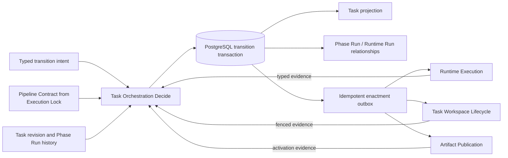

# Task Orchestration

This document records the Task Orchestration decisions resolved in
[GitHub issue 19](https://github.com/Vt00ls/SlideSmith/issues/19).
[CONTEXT.md](../../CONTEXT.md) is authoritative for domain language,
[ADR 0020](../adr/0020-centralize-task-transitions-behind-a-command-decision-seam.md)
records the interface choice, [enterprise-v1-scope.md](./enterprise-v1-scope.md)
defines the delivery boundary,
[runtime-and-pipeline-releases.md](./runtime-and-pipeline-releases.md) defines
release, compatibility, and Execution Lock authority, and
[task-workspace-lifecycle.md](./task-workspace-lifecycle.md) defines C04 commit
semantics.

The decision fixes authority, state and failure semantics, seam placement, and
downstream contracts. It does not define a schema, serialized API, queue
product, Runtime worker protocol, or implementation plan.

## Decision summary and prototype evidence

`Task Orchestration` is a deep module in the Platform Control Plane. Every
authoritative mutation of a Task's route selection, immutable locks, Phase
cursor, Confirmation Gate, Phase Run outcome, cancellation, retry, recovery,
or post-publication manual edit passes through one intent-oriented operation:

```text
Decide(TransitionIntent) -> TransitionDecision
```

`TransitionIntent` is a closed, typed union. Every variant carries `TaskID`, an
expected Task revision, an idempotency identity, and exactly one authority:

- an authorized User command, such as start, confirm, cancel, retry, or begin
  manual edit;
- work-availability or reconciliation intent from an owned worker adapter;
- Runtime Run evidence accepted through the Runtime Execution module;
- Phase validation evidence from a platform-owned validator;
- fenced Task Workspace commit/discard evidence from C04;
- Artifact Version activation evidence from publication;
- an operational fence such as recovery-degraded/read-only mode.

The operation loads authoritative state; callers do not submit a mutable Task
snapshot or a requested next status. `TransitionDecision` reports the accepted
revision, decision identity, current projection, affected Phase Run identities,
and durable enactment identities. The enactments are already committed to an
outbox in the same transaction; the caller is never responsible for making a
returned side effect durable.

Read models can expose Task progress and history through a separate query seam.
They do not expand mutation authority.

The throwaway primary-source prototype is retained outside the review branch:

- branch: `codex/prototype-task-orchestration-19`;
- commit: [`0c7295e`](https://github.com/Vt00ls/SlideSmith/commit/0c7295effa11d7ebb71d2600e9a00d17f2523b4a);
- run after checking out that branch:
  `cd backend && go run ./cmd/task-orchestration-prototype -scenario compare`.

Both shapes reached the same outcomes for Generation, Beautify, and Template
Fill Routes and for post-publication manual edit. The command/decision boundary
rejected stale or invalid input before an authoritative write. The direct
event/enactment boundary had to retain an unprojectable event; preventing that
required a pre-append command gate, which collapses to the chosen design.

## Standing constraints

- The Platform Control Plane remains authoritative for Task, Execution Lock,
  Phase Run and Runtime Run state, and commit decisions.
- Route determination atomically records one immutable Execution Lock binding
  the exact Pipeline Version, Runtime Release, and Compatibility Approval. The
  Execution Lock and separate Template Lock never float on retry, recovery,
  cancellation, or manual edit.
- Each Phase Run is one attempt of one Phase definition from the pinned
  Pipeline Version and owns zero or more Runtime Runs. Every Runtime Run belongs
  to exactly one Phase Run and uses an independent Sandbox Lease.
- Runtime evidence cannot advance a Generation Pipeline. Phase validation owns
  attempt outcome; a mutating success additionally requires C04 fenced commit
  evidence.
- C04 remains the Task Workspace Lifecycle deep module. Task Orchestration
  expresses high-level commit, discard, restore, and fence intent using opaque
  identities; paths, mounts, nodes, object locators, and byte operations never
  cross the seam.
- Artifact publication, Runtime Execution, scheduling, release publication,
  identity, Durable Object, usage, and backup remain separate authorities.

## Authority and seam placement

| Fact or action | Authority | Task Orchestration relationship |
| --- | --- | --- |
| Task revision, coarse state, Route, Execution Lock and Template Lock references, current Phase cursor, cancellation and retry decision | Task Orchestration in Platform PostgreSQL | Owns and changes through `Decide` |
| Pipeline and Runtime publication, compatibility, rollout, lifecycle, and revocation | Release Management | Supplies an exact eligible selection inside the Route transaction and later capability-scoped Runtime Bindings; cannot advance the Task |
| Immutable Phase graph, gates, contracts, retry eligibility, required capabilities, and manual-edit entry point | Release Management | Reads only the Pipeline Contract named by the Execution Lock |
| Phase Run identity, attempt number, input binding, validation result, terminal outcome, and Runtime Run membership | Task Orchestration | Creates and records; never overwrites an earlier attempt |
| Runtime Run process state, Sandbox Lease, terminal execution evidence, and runtime cancellation | Runtime Execution | Receives an idempotent enactment and returns typed evidence; cannot choose the next Phase |
| Runtime View, Task Workspace bytes, Revision, Checkpoint, commit/discard, restore, and cleanup evidence | C04 Task Workspace Lifecycle | Receives opaque intent only; accepted fenced evidence gates mutating Phase success |
| Artifact Version manifest and activation | Artifact publication | Publication evidence gates the publication Phase |
| User identity, ownership, confirmation authority, and break-glass scope | Identity & Ownership | Supplies one typed, audited authority path; workers cannot impersonate it |
| Fairness, queue order, resource admission, and delivery lease | Scheduler / queue decision | May delay or redeliver an enactment; does not change Task state |
| Metrics, tracing, logs, and audit projections | Observability and audit adapters | Consume accepted decisions and evidence; never drive state from a log |

Task Orchestration owns sequencing, not implementation mechanics. Its adapters
translate HTTP commands, worker availability, queue deliveries, Runtime
evidence, C04 evidence, and publication evidence into typed intents. No adapter
receives a general repository or a `set status` method.

## Task projection and Phase authority

The Task aggregate keeps a deliberately coarse state: ready, running, awaiting
confirmation, cancelling, failed, cancelled, or completed. Exact serialized
names remain a SPEC choice; their semantics do not. The projection also holds:

- the Task revision and active activity (Generation Pipeline or manual edit);
- the selected Route, immutable Execution Lock, and separate Template Lock
  references;
- a current Phase cursor derived from the pinned Phase graph and successful
  prior Phase Runs;
- at most one active mutation-bearing Phase Run in enterprise V1;
- the latest authoritative Task Workspace Revision, Checkpoint, and Artifact
  Version references needed by the current activity.

The coarse state is an output, not the workflow definition. A route-specific
status string cannot select a handler, define the next Phase, or prove that a
Phase contract passed. The authoritative relationship is:



Route selection is a pre-Pipeline Task decision. The accepted Route transaction
atomically records the Route and one exact Execution Lock binding its eligible
Pipeline Version, Runtime Release, and Compatibility Approval before the first
Phase Run is created. It is not fabricated as a Phase Run that lacks an
Execution Lock. A separate Template Lock must be exact and durable before its
first consuming Phase; Task Orchestration never resolves a floating version.

Pipeline Version data, rather than Task status constants, expresses all three
Route phase graphs. Confirmation Gates are ordinary Phase definitions whose
successful Phase Run may own zero Runtime Runs. The approved manual-edit entry
point is a post-publication Phase graph in the same pinned Pipeline Version and
uses the same Task, locks, interface, and Phase Run history; it is not a fourth
Route. The [release contract](./runtime-and-pipeline-releases.md) fixes the
manifest, compatibility, rollout, revocation, and Runtime Binding semantics
without changing this seam.

## Transition and evidence protocol

### Start and begin Phase

1. An authorized start intent resolves a Route through platform policy and
   atomically records the exact Execution Lock selected by Release Management.
   The separate Template Lock must already be recorded before its first
   consuming Phase.
2. Work availability causes `Decide` to select the current Phase from that
   pinned graph, create one new Phase Run attempt, and persist the required
   enactment in the same transaction.
3. A worker claims the enactment through a delivery adapter. The claim is not a
   Phase outcome and does not become Task authority.

### Runtime, validation, and commit

1. Runtime Execution creates or updates Runtime Runs under the Phase Run and
   returns evidence bound to Task, Phase Run, Runtime Run, attempt, capability,
   and fencing identity.
2. `Decide` records accepted Runtime evidence but does not advance the Phase.
   A Phase Run can coordinate zero, one, or several Runtime Runs.
3. The platform validator evaluates the complete Phase contract. Failed
   validation terminates that Phase Run as failed. Successful validation of a
   non-mutating Phase may complete it immediately.
4. Successful validation of a mutating Phase emits a C04 commit enactment. Only
   an exact, fenced C04 result that binds the resulting Task Workspace Revision
   and distinct Checkpoint can complete the Phase Run.
5. Completion advances the cursor according to the pinned graph and may make
   the next Phase eligible. No Runtime, worker, validator, or C04 adapter calls
   a next-Phase handler directly.

Publication follows the same pattern: a publication Phase may own zero Runtime
Runs and succeeds only from Artifact Version activation evidence returned by
the publication authority.

### Confirmation Gate

Entering a Confirmation Gate creates a historical Phase Run and a presentation
enactment. Only an authorized User command bound to the expected Task revision,
gate identity, and submitted values can complete it. A worker tick, Runtime
completion, or prior confirmation cannot bypass the gate. Replayed submission
returns the original decision; the same idempotency key with different values
fails closed.

### Retry and recovery

- A retry never reopens or overwrites a prior Phase Run. It creates a new
  attempt of the same pinned Phase definition with a new Phase Run identity and
  fence while preserving the earlier outcome and Runtime Run membership.
- Retry and recovery retain the Execution Lock and Template Lock. They cannot resolve `latest`,
  silently change a capability, or select a different Route.
- Recovery starts from the latest validated Checkpoint/reference permitted by
  policy and asks C04 to restore through opaque intent. Missing or corrupt
  evidence fails closed; directory or session scanning cannot prove recovery.
- Reconciliation can redeliver an existing enactment or query an existing
  downstream operation. It does not create a new Phase Run merely because a
  response or delivery acknowledgement was lost.

### Cancellation

Cancellation is a state transition, not process termination alone:

1. The accepted User or administrative intent records `cancelling`, fences new
   Phase and Runtime work, and persists cancel plus C04 fence/discard
   enactments.
2. Runtime termination evidence is recorded but cannot by itself prove that an
   isolated Runtime View can no longer commit.
3. C04 fencing evidence linearizes terminal cancellation when no mutation can
   commit. If a commit already linearized, Task Orchestration records its exact
   Revision and Checkpoint, then stops before another Phase.
4. Late evidence with a stale Phase Run, Runtime Run, operation, Task revision,
   or fence is retained only as non-authoritative diagnostic evidence and
   cannot resurrect the Task.

## Idempotency, concurrency, crash, and claim semantics

The PostgreSQL transaction that records the decision, Task revision, Phase Run
changes, evidence references, audit facts, and enactment outbox is the
linearization point.

- Every mutation intent has a scope-bound idempotency identity and canonical
  request digest. Exact replay returns the committed decision. Reuse with a
  different request is a typed conflict.
- Optimistic concurrency compares the expected Task revision before any
  authoritative append. Internal row locks or compare-and-swap may implement
  the check, but the interface exposes only the revision contract.
- A crash before transaction commit leaves no decision. A crash after commit
  but before response is recovered by replay. No caller performs compensating
  writes for an ambiguous response.
- Enactments have stable operation identities and live in the transactionally
  committed outbox. Delivery can be at least once. Downstream adapters must
  replay the same result or report the existing operation.
- Delivery leases are fenced and expiring. Claim loss returns the enactment to
  delivery without changing Task, Phase Run, or Runtime Run outcome.
- A worker or node crash never implies Runtime failure or Phase retry. The
  reconciler observes the exact Runtime/C04 operation first; only accepted
  terminal evidence can fail an attempt or make a new attempt eligible.
- Stale writers and completions are rejected by Task revision plus the exact
  Phase Run, Runtime Run, operation, and fence identities. Errors do not expose
  ownership, content, path, locator, or credential details.

## Authorization, integrity, retention, and operational evidence

- User commands require the owning User scope. Administrator operations use a
  distinct reason-bound audited scope; they never inherit User confirmation or
  content-reading authority. Worker, Runtime, C04, and publication evidence use
  mutually exclusive machine authorities.
- The module validates evidence identity, producer authority, immutable input
  bindings, result digest or manifest where applicable, and fence before it can
  affect a Phase Run. Missing, partial, duplicated, inconsistent, or corrupt
  evidence fails closed.
- Task and accepted transition metadata, the Execution Lock, Template Lock, Phase Run history, and
  Runtime Run relationships remain PostgreSQL-authoritative business and audit
  evidence. Sandboxes, sessions, Runtime Views, local paths, cache, and raw
  temporary outputs remain expiring execution material under their owning
  modules.
- The accepted decision and evidence identities are included in PostgreSQL
  backup/recovery. C04 Checkpoint bytes and Artifact bytes follow their existing
  compound recovery contracts; orchestration never infers them from a database
  row alone.
- Metrics, traces, and logs project decision ID, Task revision, Phase Run,
  Runtime Run, enactment, adapter, retry, cancellation, and reconciliation
  identities without becoming a second state machine. Issue 13 sets final
  telemetry and audit contracts.
- Repair is evidence-based. Reconciliation may restore a missing projection or
  redeliver an outbox record from an accepted decision, but cannot invent Phase
  success, adopt an orphan Runtime result, modify an expected digest, or scan a
  workspace to infer authority.

## Highest-level scenarios and adapter contracts

The Task Orchestration module itself is the highest-level state transition test
seam. An in-memory repository and deterministic adapter harness must cover:

- all three Route graphs, each Confirmation Gate, zero and multiple Runtime
  Runs per Phase Run, and a fixed Execution Lock and Template Lock across the
  complete lifecycle;
- post-publication manual edit from the latest Artifact Version, including C04
  reconstruction after execution state expiry and child publication;
- duplicate commands, same-key/different-payload conflict, optimistic revision
  conflict, concurrent confirmation/cancel/retry, and stale evidence;
- Runtime success followed by validation failure, multi-Runtime aggregation,
  C04 commit failure, commit acknowledgement loss, and publication failure;
- worker claim loss, worker or node crash, timeout, cancellation before and
  after the C04 linearization point, and restart reconciliation;
- missing, corrupt, partial, duplicated, inconsistent, unauthorized, and
  cross-Task evidence;
- recovery-degraded/read-only fencing of mutation and safe resumption after the
  authoritative recovery gate succeeds.

HTTP, worker/queue, Runtime Execution, C04, publication, PostgreSQL, audit, and
owned-transport adapters receive black-box contracts for idempotency,
concurrency, fencing, acknowledgement loss, cancellation, and non-leakage. Tests
assert identities, decisions, outcomes, and enactments rather than handler
names, status constants, SQL shape, queue product, Agent Compose commands, log
messages, paths, or session layouts.

## Deletion test and migration implications

This is a replace-not-layer seam. Once its highest-level and adapter contracts
are established, the target architecture can delete rather than wrap:

- `TaskService` route/status switches that directly choose workflow handlers;
- `ProcessQueuedTasks` / `ProcessQueuedEditSessions` as business-state writers;
- duplicated Task transition maps, route Phase order, and handler-local next
  status decisions;
- the single `TaskPhaseRun.RuntimeRunID`, runtime session, and workspace path
  coupling in favor of explicit `Phase Run 1 -> 0..N Runtime Run` ownership;
- direct path, Agent Compose, executor, publication, and C04 calls from
  orchestration decisions;
- the separate manual-edit progression authority and path/session recovery;
- compatibility fallbacks that infer current work from status, directories,
  sessions, or the most recent Runtime Run.

Issue 17 owns the exact migration matrix and cutover. It must preserve legacy
Task metadata, Source Material, Artifact Versions, lock evidence, and Phase
Run/Runtime Run history; treat legacy path/session values as non-executable
historical evidence; terminate old non-terminal Tasks as non-recoverable; and
never fabricate an Execution Lock, Runtime Run relationship, successful Phase,
Task Workspace Revision, or Checkpoint from ambiguous legacy state.

## Rejected alternatives

| Shape | Depth, locality, and leverage result | Decision |
| --- | --- | --- |
| Command/decision mutation seam with internal events and enactment outbox | Centralizes authority and failure semantics; Route differences stay in pinned data; adapters remain replaceable | Selected |
| Direct event/enactment external seam | Cannot reject unauthorized, stale, or semantically invalid input before append without adding the selected command gate | Rejected as external boundary; retained internally after acceptance |
| One workflow/state machine per Route | Local route code, but duplicates gates, retry, cancellation, evidence and history; weak leverage and high drift | Rejected |
| Existing `TaskService` plus extracted helpers | Preserves a shallow, path-aware coordinator and fails the deletion test | Rejected |
| Phase handler or Runtime Run directly advances Task | Splits authority across call sites and makes retry/crash behavior order-dependent | Rejected |
| Task Orchestration absorbs Runtime Execution, C04, publication, or scheduling | Enlarges the interface with process, bytes, vendor, path, capacity, or policy detail and destroys established deep modules | Rejected |

## Stable downstream inputs

- The resolved [Runtime and Pipeline release contract](./runtime-and-pipeline-releases.md)
  supplies the immutable Execution Lock and Pipeline Contract. The pinned
  Pipeline Version carries Route Phase graphs, Confirmation Gates, contracts,
  retry eligibility, required capabilities, and the manual-edit entry point
  consumed here.
- Issue 24 receives idempotent Runtime enactments bound to Task, Phase Run,
  Runtime Run, an exact capability-scoped Runtime Binding, immutable inputs,
  safety epoch, and fences; it returns typed evidence and never chooses a
  release, Phase outcome, or the next Phase.
- Issue 20 may prioritize and lease durable enactments, but claim ownership,
  fairness, capacity admission, and queue delivery cannot mutate Task state.
- Issue 17 maps legacy records to the Task revision, Execution Lock, Template Lock, Phase Run
  attempts, 0..N Runtime Run relationships, and non-executable historical
  evidence without restoring path authority.
- Issue 13 consumes decision, revision, run, enactment, fence, retry,
  cancellation, reconciliation, and typed failure identities as observable
  projections.
- The first implementation SPECs can treat `Decide` plus the in-memory
  state-transition harness as the authoritative module seam and keep HTTP,
  worker/queue, Runtime, C04, publication, and persistence behind adapters.

Remaining fog affecting the first Task Orchestration SPEC: none. Exact schema,
method and serialized state names, queue technology, retry timing, worker
protocol, scheduling policy, telemetry backend, and legacy batch
sequence belong to the named downstream decisions or to adapter SPECs and do
not reopen this interface.
