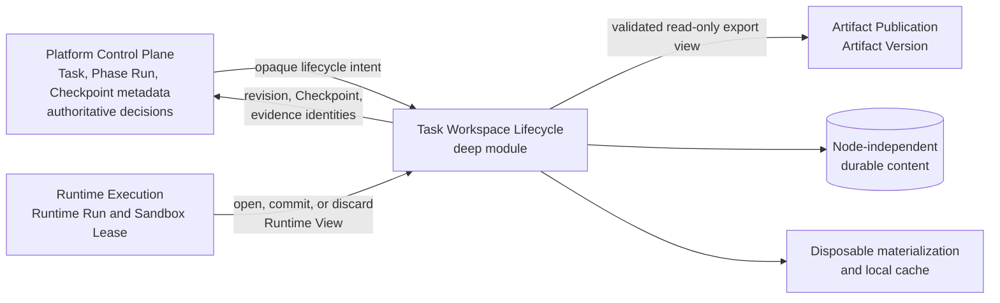
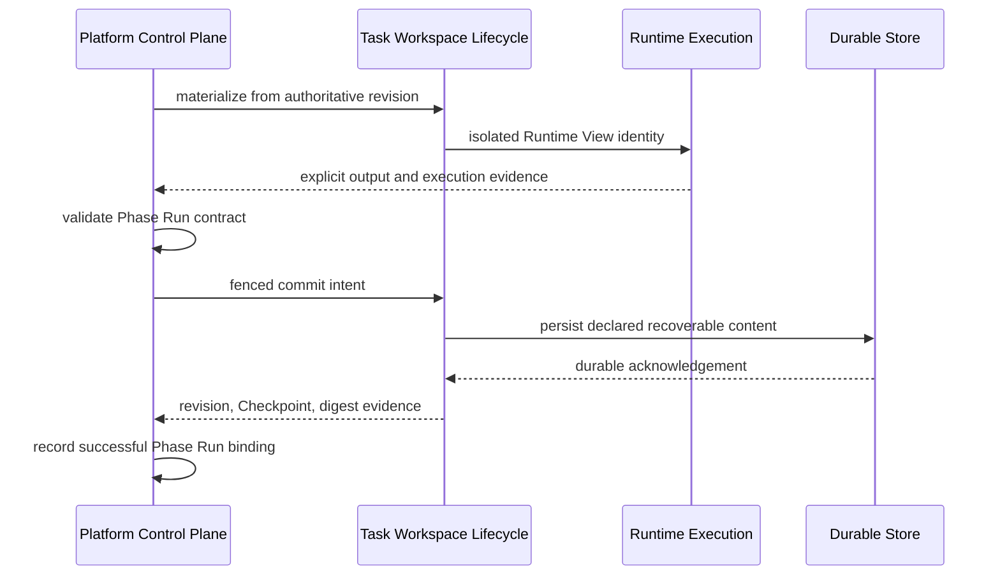

# Task Workspace Lifecycle

This document records the C04 decisions confirmed during the enterprise-platform architecture grilling. [CONTEXT.md](../../CONTEXT.md) is authoritative for domain language, [ADR 0015](../adr/0015-manage-task-workspace-state-through-an-opaque-lifecycle-seam.md) records the durable lifecycle seam, [ADR 0016](../adr/0016-hard-cut-over-legacy-execution-state.md) records the hard cutover, and [durable-object-storage.md](./durable-object-storage.md) defines the shared verified-content mechanism used by C04. This document deliberately fixes module authority and invariants without designing every method in the interface.

## Module and external seam

- The external seam lies between the Platform Control Plane and Execution Data Plane. C04 need not be deployed as an independently operated process.
- Production crosses the seam through a remote-but-owned transport adapter. Development and tests use local or in-memory adapters; workers never share or know a path such as `/data/work/task-workspaces`.
- The interface may expose workspace, revision, Checkpoint, and Runtime View identities; lifecycle state; digests and evidence; and high-level materialize, commit, discard, restore, and expire intent.
- The interface does not expose host or session paths, mounts, files, globs, copy/delete operations, storage vendors, buckets, or execution-node details.
- C03 remains the deep module for Runtime Run, Sandbox Lease, execution capacity, and process lifecycle. C05 remains the deep module for publication and immutable Artifact Versions. C04 owns neither responsibility.
- Agent Compose remains a production execution adapter under C03. It may enact work inside an opaque Runtime View but does not own Task Workspace lifecycle or recovery authority.

## State and commit semantics

- Each Task has one Task Workspace identity. Its physical materialization may expire, move, and be recreated without changing that identity.
- One authoritative writer advances a Task Workspace. Parallel Runtime Runs operate only on isolated Runtime Views and return explicit proposed output.
- Every mutating Runtime Run uses a transactional Runtime View and never writes authoritative workspace state directly. Phase Run validation precedes commit; a rejected or failed attempt discards its view.
- Phase Run success binds the validated contract, authoritative Task Workspace Revision, and validated Checkpoint metadata. Crash reconciliation is idempotent and fenced against stale writers; directory scanning is forbidden.
- Every successful Phase Run receives a distinct Checkpoint identity even when the resulting Task Workspace Revision is unchanged. Content-addressed payloads may be shared.

## Checkpoint contents and durability

- A Checkpoint captures declared recoverable state, not a byte-for-byte directory snapshot.
- Only Task-owned mutable state belongs in the Task Workspace and its Checkpoints. Runtime Releases, Template Versions, Resource Bundles, Source Material, shared cache, sessions, duplicate durable inputs, and failed residue are immutable or disposable inputs outside that state.
- Local materialization caches are digest-addressed and live outside Task Workspaces and Checkpoints.
- A Phase Run cannot commit successfully until Checkpoint metadata and all referenced content are durable in a node-independent store. Missing content, failed acknowledgement, or digest mismatch fails closed.
- C04 owns integrity, reference, deduplication, retention, and reclamation semantics. Database, object-storage, and filesystem implementations sit behind internal adapters and do not enlarge the external interface.
- Checkpoints remain while reachable from the current recovery lineage or an explicit reference. Artifact Versions remain independent, long-lived business publications.
- C04 uses the shared `Durable Object` module for opaque content identities, verification receipts, typed references, and lease-based materialization. That internal mechanism does not transfer Checkpoint lifecycle authority to the storage module.

## Manual edit and publication

- Manual editing reuses the Task's existing Task Workspace identity; no durable `manual-edit-workspace` exists.
- Enterprise V1 edits only the latest Artifact Version. If execution state expired, C04 reconstructs the Task Workspace from that version.
- A successful edit creates a Task Workspace Revision and Checkpoint. C05 then publishes a child Artifact Version with parent lineage.
- C04 supplies validated Checkpoint, revision, and read-only export evidence. Publication never scans a live workspace or session and never infers authority from modification time.

## Lifecycle debt and operational evidence

- C04 owns materialization expiry, Checkpoint reclamation, Runtime View cleanup, cache reclamation, and failed-residue cleanup. Callers do not perform direct recursive deletion.
- Cleanup failure creates durable, retriable Cleanup Debt containing its owner, opaque resource identity, retry count, last error, estimated bytes and inodes, and debt age. It is exposed through health, metrics, and administrator diagnostics until resolved.
- C04 persists authoritative lifecycle transitions and audit facts. Metrics, tracing, and structured logs project those facts through internal adapters; callers do not assemble parallel observability calls.
- Ordinary telemetry adapter failure does not roll back a completed lifecycle transition, while authoritative lifecycle, audit, and Cleanup Debt records remain consistent.

## Highest-level test seam

Tests exercise materialize → Runtime View → validate/commit or discard → Checkpoint → expire/restore through the lifecycle interface. They assert opaque identities, revisions, lifecycle states, digests, and evidence rather than directory layout.

The scenario suite covers fault injection at every commit stage, stale-writer fencing, concurrent isolated Runtime Runs, content deduplication, reachability retention, Cleanup Debt retry, hard-cutover deletion, and manual-edit reconstruction from an Artifact Version. Local filesystem, durable-store, and owned-transport implementations receive adapter contract tests.

Replacement follows the deletion test: once interface-level and adapter contract tests exist, delete tests and implementation that only verify `HostDir`, copied Skill paths, session scans, last-session recovery, filesystem layout, direct recursive deletion, or per-workflow cleanup markers. If C04 were then deleted, restore, checkpoint, materialization, reclaim, and debt complexity would reappear across every Phase and worker, demonstrating the module's depth, locality, and leverage.

## Hard cutover

- Do not migrate legacy workspaces, Agent Compose sessions, caches, or failed residue.
- Preserve Task metadata, Source Material, Artifact Versions and Artifacts, release and template locks, and Phase Run and Runtime Run history.
- Terminate old non-terminal Tasks as non-recoverable. A user who needs to continue starts a new Task from retained inputs or publications.
- Delete legacy execution data. Each failed deletion becomes Cleanup Debt under the new lifecycle authority.
- Do not retain a path-based compatibility facade or recover state by scanning legacy directories.
