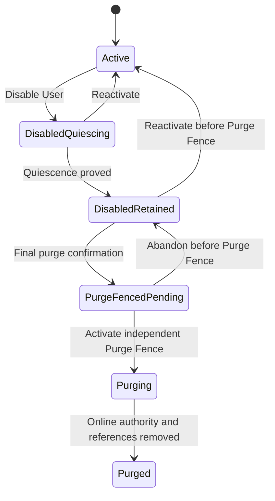
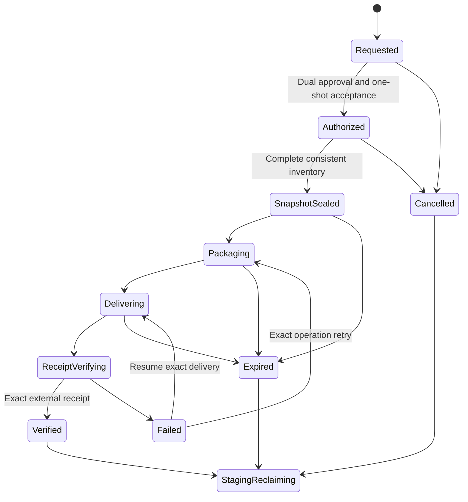
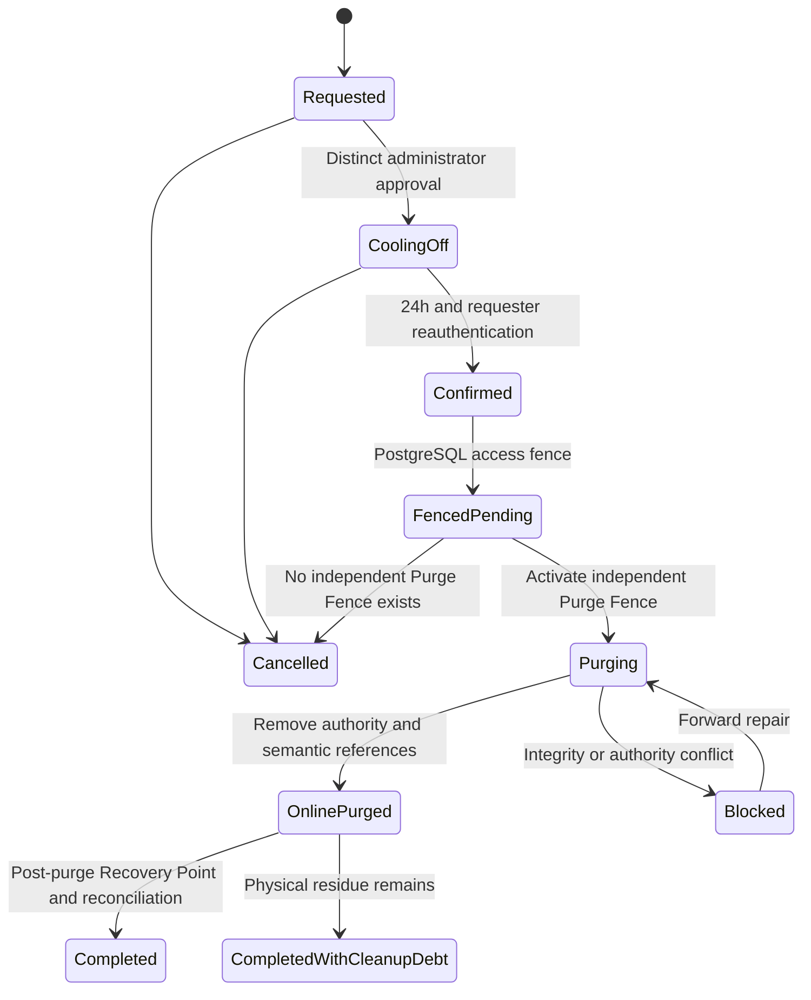

# Workspace Export and Purge

This document records the disabled-User Workspace Export and purge contract
resolved in [GitHub issue 25](https://github.com/Vt00ls/SlideSmith/issues/25).
[CONTEXT.md](../../CONTEXT.md) is authoritative for domain language,
[ADR 0018](../adr/0018-export-and-purge-disabled-user-workspaces.md) records
the durable no-transfer and irreversible-purge decision, and the accepted
[Identity & Ownership](https://github.com/Vt00ls/SlideSmith/issues/18#issuecomment-5041095988),
[content authorization](./content-authorization-and-sharing.md),
[Durable Object](./durable-object-storage.md),
[Backup & Recovery](./backup-and-recovery.md),
[observability and Cleanup Debt](./observability-audit-and-cleanup-debt.md), and
[legacy migration](./legacy-business-migration-and-compatibility.md) contracts
remain authoritative for their respective seams.

The design fixes access, export coverage and representation, delivery proof,
asynchronous execution, authorization, purge eligibility and linearization,
cascade boundaries, retention, recovery suppression, observability, failure,
and Cleanup Debt. It deliberately does not select a database schema, queue,
archive vendor, object-store vendor, signing or KMS product, wire protocol,
administrator UI, implementation sequence, production target, or physical
deletion command. Publishing this decision does not authorize a production
export or purge.

## Decision summary

User disable immediately fences owner, Share, and mutation authority while
retaining the same User and Personal Workspace. After active work quiesces, a
dual-controlled one-shot break-glass decision may create one complete,
generation-bound Workspace Export and deliver it to an allowlisted external
administrative archive. Only an independently verified Export Delivery Receipt
for the exact canonical manifest can later satisfy one purge precondition.

Purge is a separate dual-controlled administrator intent. It has a mandatory
24-hour cooling-off period and final reauthentication, and it revalidates
quiescence, export completeness, receipt, Workspace generation, backup health,
retention clearance, references, leases, integrity, and policy immediately
before proceeding. A Purge Fence in an independent immutable suppression
authority is the irreversible linearization point. Before it, reactivation or
cancellation is possible; after it, recovery is forward-only and no database,
backup, or exact-byte repair may resurrect the Workspace.

Enterprise V1 performs no automatic purge and has no timer that turns disable
into deletion authority. A disabled Workspace remains recoverable until an
explicit purge reaches the Purge Fence. V1 does not implement legal hold,
records management, or e-discovery; a known or uncertain external preservation
obligation blocks purge and has no administrator override.

Purge removes SlideSmith's online business authority and eventually reclaims
its primary and backup bytes. It does not delete the independently delivered
external archive or bytes already disclosed to a recipient. After purge, the
old User, Personal Workspace, and external-identity mapping are terminal and
cannot be reactivated or reused in V1.

## Standing constraints and confirmed policy

- One User owns one non-transferable, non-reused Personal Workspace. Tasks do
  not transfer between Personal Workspaces.
- Platform Administrators have no implicit User-content access. Workspace
  Export consumes a dual-approved, exact-target, one-shot break-glass grant;
  purge is not a break-glass capability.
- Export and purge are separate intents. Attempt, response start, partial
  delivery, callback, or missing receipt never authorizes purge.
- Business metadata and typed references live in Platform PostgreSQL. Actual
  immutable bytes remain behind Durable Object; neither side alone proves a
  complete export or deletion.
- Artifact Versions are immutable retained business publications. Checkpoints
  are retained only while recovery-reachable or explicitly referenced, and
  execution materialization remains disposable.
- Mandatory audit commits with the protected decision and fails closed.
  Telemetry and external audit delivery remain expiring projections.
- Primary bytes use the existing default seven-day non-zero reclamation grace.
  Immutable Recovery Points use the existing normal 35-day window and are not
  rewritten for a business deletion.
- There is no automatic purge. The disabled-retention interval has no V1
  maximum; reactivation remains possible until the Purge Fence.
- Purge approval has a non-bypassable 24-hour cooling-off period followed by
  requester reauthentication and confirmation.
- A purged User, Workspace, and external-identity mapping are terminal in V1.
- Known or uncertain legal, investigation, audit, or records-preservation need
  blocks purge. SlideSmith records external clearance evidence but does not
  adjudicate or override it.
- External archive retention and deletion are outside SlideSmith purge.

## Module authority and seams

`Workspace Export & Purge` is a Platform Control Plane deep module. It owns:

- export and purge operation identities, canonical request digests, states,
  generations, claims, fences, retry, deadlines, and evidence;
- the sealed Workspace export snapshot, coverage policy, inventory roots,
  canonical manifest digest, archive digest, and delivery-verification result;
- purge request, approval, cooling-off, confirmation, eligibility decision,
  Purge Fence relationship, cascade inventory, progress, and terminal result;
- recovery-suppression and Workspace Tombstone intent; and
- authoritative export/purge audit and operation diagnostics.

It does not take over User status, Task, publication, Checkpoint, sharing,
usage, content, object, backup, audit, or cleanup authority:

| Fact or action | Authoritative owner |
| --- | --- |
| User lifecycle, Personal Workspace identity and generation, external mapping | Identity & Ownership |
| Break-glass request, dual approval, expiry and one-shot acceptance | BreakGlass |
| Task, Phase Run, Runtime Run, Confirmation Gate and mutation quiescence | Task Orchestration and Runtime Execution |
| Artifact Version membership, lineage and availability | Artifact Publication |
| Checkpoint reachability and Task Workspace content | Task Workspace Lifecycle |
| Share Grant invalidation, verifier and session lifecycle | Sharing |
| Usage Ledger, corrections, receipt roots and reconciliation | Usage Accounting |
| Typed content references, verified immutable bytes and primary reclamation | Durable Object |
| Recovery Points, watermark, exceptional pins and suppression on restore | Backup & Recovery |
| Mandatory audit mechanics and Cleanup Debt lifecycle | Shared audit facility and each resource owner |
| External archive immutable object and delivery verification | Allowlisted administrative archive adapter |

Representative high-level intents, not final method or wire names, are:

```text
PrepareWorkspaceExport(BreakGlassMachineScope, WorkspaceGeneration, Target, Idempotency)
  -> ExportOperation

InspectOperation(AdministratorMetadataScope, OperationID)
  -> content-free progress | protected denial

RequestPurge(AdministratorPrincipal, WorkspaceGeneration, VerifiedExport, Clearance)
  -> PurgeRequest

ApprovePurge(DistinctAdministratorPrincipal, PurgeRequest)
  -> CoolingOffDecision

ConfirmPurge(RequesterAdministratorPrincipal, PurgeRequest)
  -> PurgeOperation | stale/ineligible/denied
```

Callers never receive a Workspace repository, raw object list, manifest
builder, byte deletion API, backup locator, path, bucket, archive credential,
or method that combines export and purge.

## User disable, access, and quiescence



The disable transaction advances the User authorization generation and
Workspace share generation, terminally invalidates Share Grants and
Verification Sessions, fences new owner sessions and content handles, rejects
new Task mutation and manual edit, and records mandatory audit and idempotent
quiescence enactments. It does not delete or rewrite retained work.

An immutable stream whose authorization audit and ReadHandle already
linearized may finish. Every new handle, including a Range request, fails
closed. New Scheduler admission, Runtime Binding use, Gateway Grant, Task
transition, Runtime View commit, Artifact publication, Checkpoint commit,
Share mutation, and owner mutation is rejected under the new generation.

`DisabledQuiescing` coordinates existing operations rather than guessing from
process state:

- Scheduler Work Items and Admission Grants are withdrawn or terminalized;
- Runtime Runs are cancelled, lost, or truthfully terminalized and their
  uncommitted Runtime Views are discarded;
- active manual edits and publication intents either committed before the
  disable fence or terminate without becoming business facts;
- active Quota Reservations close through Usage Accounting without treating
  unknown or late usage as zero;
- leases, claims, outbox enactments, and machine capabilities that could mutate
  the Workspace are absent or fenced; and
- cleanup failure becomes Cleanup Debt but cannot restore mutation authority.

Quiescence is an authoritative cross-module evidence root. A worker count,
queue depth, process list, directory, session, log, trace, or elapsed timeout
cannot prove it.

In `DisabledRetained`, owner and Share access remain denied. Administrator
metadata and recovery control remain content-free. The only permitted content
path is an exact `PrepareWorkspaceExport` machine operation derived from the
one-shot break-glass grant. Reactivation before the Purge Fence preserves the
same identities, advances generation again, and makes every prior export and
purge operation ineligible even when its external archive still exists.

## Export authorization and state

The accepted break-glass contract applies unchanged: two distinct active
Platform Administrators, recent enterprise authentication, reason, incident or
ticket reference, exact disabled Personal Workspace, closed export intent,
data-minimization assertion, generation, expiry, and mandatory audit.

Approval consumes one `PrepareWorkspaceExport` acceptance and creates a
separately fenced machine operation. It does not grant interactive Workspace
browsing. Expiry of the human grant after acceptance does not interrupt the
accepted machine operation, but the export operation has a 72-hour default
deadline and seven-day hard maximum. Deployment policy may shorten these
values. Exceeding the deadline terminalizes the operation and requires a new
break-glass request.



The snapshot is a transaction-consistent, generation-bound selection of
authoritative PostgreSQL business records plus their exact Durable Object
references and receipts. Its canonical class roots, counts, and bytes are
sealed before packaging. Retries under the same ExportID never rescan a changed
Workspace or select a different target. A new generation, coverage policy, or
archive target requires a new export.

## Export coverage and exclusions

The export covers the complete owner-visible retained business state for the
sealed Workspace generation. Required classes cannot be omitted by an
administrator.

| Class | Export disposition |
| --- | --- |
| User and Personal Workspace | Stable opaque identities, status, generation and content-safe profile metadata; no credential or mutable identity-provider token |
| Tasks | All Task identities, titles, timestamps, Route, business state, confirmations and owner-visible authoritative metadata |
| Source Material | Every retained Source Material identity, semantic metadata and verified immutable payload |
| Artifact Versions and Artifacts | Every available immutable version, member, canonical manifest, lineage, active/latest disposition and verified payload |
| Checkpoints | Every Checkpoint still retained by current recovery reachability or explicit reference, including its declared Task-owned state manifest and payloads |
| Locks and run history | Exact Execution and Template Lock references; content-safe Phase Run, Runtime Run and edit history with terminal disposition and evidence roots |
| Usage | Usage Ledger entries, corrections, actual/estimated/unknown distinction, late/unresolved reconciliation state and content-free receipt roots |
| Sharing | Content-free Share Grant identities, exact Artifact Version target and issued/expiry/terminal disposition; never tokens, codes, verifiers, sessions or network evidence |
| Legacy history | The target-native owner-scoped read-only legacy-history projection and disposition roots |
| Export evidence | Coverage policy, inclusion/exclusion roots, counts, bytes, manifest and archive proof |

Explicit exclusions are:

- Task Workspace materializations, Runtime Views, sandboxes, Agent Compose
  projects, runs and sessions, caches, temporary directories, failed residue,
  unactivated staging, and incomplete publications;
- expired or unreachable Checkpoints and any state not already authoritative;
- Runtime Images, Runtime Release packages, Template Version packages and
  Resource Bundle bytes. Locks retain exact identities, manifests and digests;
- Share Link tokens, Access Codes, verifiers, Verification Sessions, rate-limit
  buckets, exact network evidence, and secrets;
- raw audit facts, logs, traces, commands, prompts, provider or runtime
  responses, unrestricted errors, paths, object keys, locators and credentials;
  and
- platform-owned configuration or content from another Personal Workspace.

Authoritative audit remains in SlideSmith and is not copied as a content
archive. The package contains only a content-free evidence root and the
business-safe sharing summary above. Open execution-residue Cleanup Debt is an
exclusion summary and does not block export. A missing, corrupt, ambiguous, or
unverified required business record or payload blocks `Verified`; the package
cannot label known loss as a successful export. Accepting incomplete export
and subsequent loss would require a separate human-authority decision.

## Canonical archive and integrity proof

Workspace Export V1 is a deterministic ZIP64 container:

- UTF-8 canonical JSON and JSON Lines carry the manifest and business records;
- payloads are stored once under `content/sha256/<digest>` and related to
  business identities only through the manifest;
- entries use deterministic ordering, normalized timestamps and modes, the
  Store method, and no absolute path, `..`, symlink, hard link, device,
  duplicate path, alternate stream, or caller-controlled extraction target;
- logical names remain data inside canonical JSON rather than archive paths;
  and
- archive format, canonicalization, digest and signature algorithm versions
  are explicit and versioned.

The top-level canonical manifest binds at least:

- ExportID, UserID, PersonalWorkspaceID and Workspace generation;
- sealed database snapshot/revision identity and export time;
- coverage, schema, canonicalization, archive and policy versions;
- ordered roots, counts and bytes for every included and excluded class;
- each business record identity and canonical record digest;
- each payload's content identity, digest algorithm, digest, size, media type
  and source DurabilityReceipt root;
- exact inclusion/exclusion reasons and completeness result;
- external ArchiveTargetID and operation deadline; and
- the canonical manifest digest, archive digest and platform signature/key
  version.

The archive is staged encrypted and delivered over authenticated TLS. The
canonical archive digest is independent of adapter encryption; when the target
adds an encryption envelope, the adapter records both canonical and envelope
digests without exposing keys or locators.

An acceptable external archive adapter supports immutable exact-object
creation, conditional/idempotent retry, resumable multipart transfer, digest
and size verification, and independent read-after-write or equivalent
verification. Target selection is from a platform allowlist; no administrator
supplies an arbitrary URL, bucket, path or credential.

An Export Delivery Receipt binds:

- ExportID, Workspace identity and generation;
- canonical manifest and archive digests, size and format version;
- allowlisted ArchiveTargetID, immutable external object identity and
  generation or version;
- complete transfer and independent verification times and method;
- external authority, adapter and receipt schema versions; and
- an authenticated receipt digest or signature.

A callback, multipart completion, successful HTTP status, byte count alone,
unverified object listing, partial read, or requester assertion is not a
receipt. A lost response is reconciled by querying the exact immutable target;
the same delivery identity with another digest is an integrity incident.

After `Verified`, cancellation or expiry, archive staging and any content-
bearing local manifest become immediately eligible for reclamation. SlideSmith
retains only the content-free manifest digest, class roots/counts, archive
digest, receipt and audit needed to revalidate purge. Reclamation failure is
Cleanup Debt and does not convert staging into a business publication or
backup.

## Idempotency, retry, and concurrency

Export and purge have different operation identities and canonical intent
digests. Exact replay returns the authoritative result; same identity with
different Workspace, generation, target, manifest, receipt, policy, approval,
or clearance is an integrity conflict.

Claims and adapter operations are expiring and fenced. Claim loss redelivers
the same operation. Packaging and multipart delivery resume only from
verified chunk evidence bound to the archive digest. A stale worker cannot
seal another snapshot, replace a receipt, extend a deadline, activate a Purge
Fence, detach a newer reference, or resolve Cleanup Debt.

Several verified exports may exist as historical delivery facts, but a purge
selects exactly one whose generation, coverage policy, completeness roots and
receipt match current eligibility. Reactivation, identity rebind, policy
invalidation or any Workspace generation change makes the old export
ineligible without deleting its external copy or rewriting its audit.

## Purge authorization and eligibility

Purge is not content access and no BreakGlass Grant, export worker or delivery
receipt can invoke it. It requires:

1. one active Platform Administrator requests purge with recent enterprise
   authentication, exact Workspace/generation, selected verified export,
   reason, ticket reference, clearance assertion and idempotency identity;
2. a different active Platform Administrator independently approves the exact
   canonical request with recent enterprise authentication;
3. a non-bypassable 24-hour cooling-off period begins after approval;
4. the requester reauthenticates after cooling-off and confirms the unchanged
   request; and
5. the module revalidates every eligibility fact immediately before fencing.

Role, authorization generation, request, approval, selected receipt, policy,
Workspace generation or clearance change invalidates the pending request. V1
has no emergency bypass or administrator self-approval.

The final eligibility gate requires all of the following:

- User is disabled, the same Workspace generation is `DisabledRetained`, and
  quiescence evidence remains current;
- no active owner/share access, Runtime Run, manual edit, publication intent,
  mutation-bearing Work Item or Admission Grant, Quota Reservation, lease,
  claim, machine capability, or enactment can commit;
- one complete export matches the current generation and coverage policy, its
  manifest roots recompute from current retained authority, and its Export
  Delivery Receipt revalidates against the exact external immutable object;
- no required business record or content has a missing, corrupt, ambiguous,
  partial, or unverified state;
- no active integrity incident, reference, lease, grace, quarantine or
  retention fact contradicts the sealed purge inventory;
- no known or uncertain external legal, investigation, audit, records, or
  preservation obligation applies, and the approval references the enterprise
  clearance evidence. The Platform does not override or interpret that fact;
- the newest finalized Recovery Point watermark is healthy and covers the
  export snapshot and evidence;
- no cutover, incident, investigation, rollback or exceptional Recovery Point
  pin would retain purged content beyond the normal 35-day window; and
- mandatory audit and independent suppression authority are healthy.

Execution-residue Cleanup Debt does not block purge when it is outside export
coverage and cannot expose or mutate business content. Cleanup Debt or an
integrity incident involving a required business reference, included payload,
suppression fact or purge target does block.

## Purge state, linearization, and cancellation



The irreversible sequence is:

1. a PostgreSQL `PurgeFencedPending` transaction records the final decision,
   sealed cascade root, before-state generations, mandatory audit and outbox,
   and denies every new content, mutation, export, recovery and reactivation
   path;
2. the independent immutable suppression adapter activates the exact Purge
   Fence bound to that pending decision, Workspace generation, purge inventory
   root and policy. This activation is the irreversible linearization point;
3. PostgreSQL records `Purging`, the Purge Fence receipt and terminal
   generations, then owning modules process the sealed cascade in fenced,
   idempotent batches; and
4. Backup & Recovery finalizes a post-purge Recovery Point containing the
   tombstone and suppression root before the operation reports completion.

Before step 2, failure or cancellation can return the still-disabled Workspace
to `DisabledRetained` after proving no Purge Fence exists. After step 2, no
cancel, reactivation, rollback, old Recovery Point, exact-byte repair, or
administrator exception can restore content authority. A crash between steps
is reconciled from the PostgreSQL pending decision and independent fence. The
Workspace remains inaccessible while reconciliation is ambiguous.

`OnlinePurged` means every online business surface denies the Workspace and
all semantic content references are detached. It does not claim that primary
physical generations, cache residue or locked backup copies are already
absent. Persistent semantic inconsistency keeps the operation `Blocked` and
requires forward repair; it cannot be hidden with a cleanup exception.

## Cascade and retained records

Purge is Workspace-wide and cannot select individual Tasks or record classes.
Each owning module removes its own authority under the sealed purge inventory.

| Record or resource | Purge behavior |
| --- | --- |
| User, Personal Workspace, external identity mapping | Replace active authority with terminal, non-reused Workspace Tombstone and retired mapping; no V1 reactivation |
| Tasks, confirmations, owner-visible metadata | Remove online business records and access projections |
| Source Material | Detach every typed reference; primary reclamation follows Durable Object grace |
| Artifact Versions and Artifacts | Terminally make unavailable, invalidate sharing, remove metadata/membership and detach typed references |
| Task Workspace, Checkpoints and revisions | Remove lifecycle authority and detach retained Checkpoint references; materialization residue is cleanup work |
| Phase Runs, Runtime Runs, edit sessions and locks | Remove Workspace business history and release package references; preserve only opaque attribution where retained Usage or audit requires it |
| Share Grants and Verification state | Already terminal from disable; remove verifiers, sessions and online grant projections, retaining content-free lifecycle audit under policy |
| Usage Ledger and required evidence | Retain append-only entries, corrections, actual/estimated/unknown distinction, late/unresolved reconciliation and content-free receipt roots |
| Authoritative audit | Retain append-only facts and opaque target identities without retaining User content |
| Export and purge evidence | Retain manifest/archive digests, content-free roots/counts, receipt, approvals, fence, tombstone, suppression and terminal evidence |
| Platform packages | Release exact Task references; package owners retain or reclaim under other Tasks, pins, incidents and Recovery Points |
| External archive and disclosed bytes | No deletion; outside SlideSmith authority and retention |

The Workspace Tombstone contains only the stable opaque User and Workspace
identities, retired external-mapping evidence, terminal generation and state,
disable/purge times, policy version, selected ExportID/manifest digest/receipt,
Purge Fence and suppression roots, and decision/audit identities. It contains
no title, Source Material, Artifact name, filename, content, secret, locator,
path, mutable profile value, or external archive credential.

Usage Ledger and audit records may retain opaque Task, Phase Run, Runtime Run,
Artifact Version or grant identities after the target row disappears. These
are immutable historical attribution values, not live foreign authority or a
route back to content. Verified late Usage Receipts and offsetting corrections
may still append under the retained Ledger; no new Task, Reservation or
provider work can start for the purged Workspace.

## Durable Object, primary reclamation, and backup

Semantic reference detach immediately removes online access. Durable Object
then places a physical payload in `pending_reclaim` only when no other typed
reference, lease, protected staging intent, incident or pin remains. Multiple
equal payload references inside the Personal Workspace policy domain are
released independently; there is no cross-Workspace deduplication to turn
purge into another Workspace's deletion.

The existing default seven-day grace applies to the final primary reference.
Shortening policy never retroactively accelerates a purge candidate without a
new authorized decision. Physical delete is idempotent and generation-fenced.
A listing, path absence, metric, log or unsigned adapter response cannot prove
reclamation. Failure creates or updates one Cleanup Debt under the resource
owner.

Existing immutable Recovery Points are not rewritten. Their encrypted bytes
remain inaccessible behind the Purge Fence and suppression root until the
normal 35-day window expires. Purge is ineligible while an exceptional pin
would extend that presence beyond the normal window. Backup lifecycle deletion
and primary reclamation remain separate state machines.

Every restore imports the current independent Purge Fence and suppression
inventory before `ReadOnlyReady`. A selected database point that predates the
purge may restore encrypted rows and bytes into isolation, but the restore must
apply tombstone and suppression before any User-content promotion. An old
User, Share Grant, BreakGlass Grant, object reference or Workspace state never
becomes active. A backup is not a Workspace Export, legal archive, or escape
from purge.

## Audit, progress, diagnostics, and alerts

Mandatory authoritative audit applies to:

- disable, quiescence, reactivation and generation invalidation;
- export request, approval, one-shot acceptance, snapshot seal, content-handle
  use, packaging, each delivery attempt, receipt verification and expiry;
- purge request, independent approval, cooling-off completion, final
  confirmation, denial, cancellation and stale invalidation;
- eligibility result, clearance reference, `PurgeFencedPending`, independent
  Purge Fence activation, every cascade batch, suppression, post-purge
  Recovery Point, terminal result and accepted physical-residue exception; and
- Cleanup Debt creation, retry, resolution and manual exception.

Audit contains identities, generations, policy, target, closed intent, actor,
approver, reason, ticket, result, safe error class, counts, digests and evidence
roots, but no Workspace content, logical filename, token, code, verifier,
credential, object locator, path, raw URL or unrestricted error.

Protected administrator diagnostics expose OperationID, authoritative state,
Workspace generation, class-level counts and bytes, progress and source
watermarks, receipt and backup verification state, cooling-off time, current
blocker, claim/retry generation, next action, safe failure class, estimated
residue, Cleanup Debt and evidence references. Exact record inventory and
content remain unavailable without the applicable break-glass scope.

Bounded metrics cover export and purge operation state, duration, bytes and
record-count bands, staging age, delivery and receipt result, cooling-off,
eligibility denial category, cascade lag, primary and backup suppression,
reclamation, and Cleanup Debt. User, Workspace, Task, ExportID, receipt,
manifest digest, path, locator and free-form error never appear as metric
labels.

Immediate security or integrity notification applies to export break-glass
activation/use, receipt digest conflict, unauthorized deletion attempt,
Purge Fence activation, purge generation or inventory conflict, suppression
failure and any attempt to restore a fenced Workspace. Existing Cleanup Debt
warning and critical thresholds remain unchanged.

Mandatory audit failure blocks the operation. Metrics, trace, log, dashboard
or external audit-sink failure does not roll back an accepted decision; it
creates retry backlog, degraded evidence and alerts. No projection can prove
delivery, eligibility, purge, reclamation or restore suppression.

## Failure and recovery semantics

| Failure | Required behavior |
| --- | --- |
| Quiescence cannot be proved | Remain disabled and inaccessible; retry or repair exact owning-module facts; do not export or purge |
| Required export record or byte missing/corrupt | Integrity incident; fail export; retain Workspace; no incomplete-export override |
| Packaging or delivery interrupted | Resume the same sealed snapshot and archive digest under a fenced claim |
| Delivery response lost | Query and verify the exact immutable external object; never infer receipt from upload state |
| Receipt digest or generation mismatch | Quarantine the result, alert, fail closed, and require a new valid export when repair is impossible |
| Reactivation before Purge Fence | Invalidate all old export/purge eligibility through generation advancement; external archive remains historical custody |
| Eligibility fact changes during cooling-off | Invalidate the request and require a new request and distinct approval |
| `PurgeFencedPending` fails before external fence | Prove no Purge Fence exists, then retry or return to `DisabledRetained` |
| Crash after Purge Fence | Keep access denied and reconcile forward from independent fence and sealed inventory |
| Semantic detach transient failure | Retry idempotently under the same purge operation and current fence |
| Semantic integrity conflict | Remain `Blocked`; forward repair exact facts; do not report purge complete or accept an exception |
| Primary physical deletion failure | Preserve logical purge; create/update resource-owner Cleanup Debt; never report reclaimed bytes |
| Post-purge Recovery Point delayed | Keep purge non-complete and alert; never roll back or re-enable the Workspace |
| Restore selects an old point | Apply independent Purge Fence and suppression before promotion; fenced Workspace remains terminal |

Cleanup Debt is created before or with the first physical cleanup attempt and
uses the established `Open`, `Claimed`, `RetryScheduled`, `Blocked`, and
`Resolved` protocol. `AcceptedException` may acknowledge inaccessible physical
residue for a closed reason and duration, but cannot retain a live semantic
reference, permit content access, clear suppression, resurrect identity, or
report bytes and inodes as reclaimed.

## Retention matrix

| Record or bytes | Enterprise V1 retention |
| --- | --- |
| Disabled Workspace before purge | Indefinite until explicit purge; no automatic expiry or purge timer |
| Export archive, staging and content-bearing local manifest | Immediate reclamation after verified delivery, cancellation or operation expiry |
| External administrative archive | Outside SlideSmith retention and purge; governed by external custodian |
| Workspace Tombstone, retired identity mapping, manifest/archive digest, receipt, Purge Fence and suppression | Retained business records; no V1 automatic expiry |
| Usage Ledger, corrections and required receipt/reconciliation roots | Retained under existing append-only business-record policy |
| Export/purge and owning-record audit | With the owning record and at least 365 days after the later of event or purge |
| Share/break-glass audit | Existing minimum of 365 days after the later of event or target terminal/purge |
| Open Cleanup Debt and retry history | Until exact resolution |
| Resolved Cleanup Debt, resolution audit and evidence root | At least 365 days after resolution, or longer with the owning record |
| Primary Durable Object bytes after final detach | Inaccessible immediately; existing default seven-day grace before physical reclamation |
| Locked backup residue | Inaccessible and naturally expired within the normal 35-day Recovery Point window; exceptional pins block purge |
| Logs, traces and metrics | Existing content-free 30-day, 14-day and 30/90-day projection baselines |

Shortening retained tombstone, identity, receipt, suppression, Usage Ledger or
authoritative audit policy; adding automatic purge; accepting incomplete
export; overriding preservation clearance; or promising faster backup erasure
requires a new human-authority decision.

## Highest-level scenarios and adapter contracts

The `Workspace Export & Purge` interface is the highest-level operation test
seam. A deterministic harness with controllable clocks, PostgreSQL
transactions, claims, generations, object faults, archive acknowledgement,
backup points, audit failure and restore covers:

- disable during owner stream, Task transition, Runtime Run, manual edit,
  publication, Reservation and cleanup, including exact quiescence;
- reactivation before and after export, during cooling-off, before pending
  fence, and prohibited after Purge Fence;
- complete Tasks, Source Material, Artifact lineage, retained and expired
  Checkpoints, locks, Usage history, sharing summary and legacy history;
- missing, corrupt, duplicate, ambiguous, orphan, cross-Workspace and
  unverified records and bytes;
- deterministic second archive, canonical root/signature, unsafe names,
  payload deduplication, ZIP64 boundaries and large multipart delivery;
- response loss, resume, duplicate delivery, same-key/different-digest,
  external readback failure and forged receipt;
- self-approval, stale administrator generation, changed policy, cooling-off
  boundary, failed reauthentication, preservation uncertainty and old export;
- backup degraded mode, exceptional pin, pre- and post-purge Recovery Points,
  old-point restore and suppression non-resurrection;
- crash before and after every pending/fence/cascade transition, stale workers,
  semantic blockers, physical Cleanup Debt and accepted residue exception;
- permanent owner/share/break-glass denial after purge, late Usage Receipt and
  append-only correction; and
- mandatory-audit outage, external sink outage, protected diagnostics,
  cardinality, redaction, alert and retention behavior.

Identity & Ownership, BreakGlass, Task Orchestration, Runtime Execution,
Artifact Publication, Task Workspace Lifecycle, Sharing, Usage Accounting,
Durable Object, Backup & Recovery, audit, external archive, signing/KMS and
owned-transport adapters receive black-box contracts for idempotency,
authorization, integrity, fencing, acknowledgement loss, non-leakage and fault
injection. Tests assert identities, states, roots, receipts, fences, decisions,
evidence and denials rather than schema, SQL, queue messages, bucket layout,
paths, vendor commands or log text.

## Legacy migration and deletion test

Workspace Export and purge operate only on target-native, owner-scoped facts.
Legacy cutover must finish, `CommitCutover` must close routine rollback, and
any cutover Recovery Point pin that would exceed the normal purge backup window
must be released before purge eligibility. The export includes migrated
Source Material, Artifact Versions and owner-scoped legacy-history projection;
it never exports or adopts legacy workspaces, sessions, paths, caches, markers
or ambiguous execution residue.

Implementation is replace-not-layer. The target operation must not depend on:

- global Task or Artifact repositories and raw-ID HTTP routes;
- `StorageService.Root`, `Path`, object keys, directory walks or prefix delete;
- Task Workspace, Agent Compose session, process, marker or path scanning;
- raw audit, log, trace or metric export as business data;
- bucket or backup listing as coverage, delivery or deletion authority; or
- a combined export-and-delete handler or an administrator owner impersonation
  path.

If removing `Workspace Export & Purge` would force authorization, snapshot,
coverage, archive, receipt, approval, cooling-off, fencing, cascade,
suppression, retention, reconciliation and Cleanup Debt logic back into every
handler and owning module, the module passes the deletion test.

## Rejected alternatives and downstream inputs

Rejected alternatives include Personal Workspace or Task transfer; automatic
purge after disable; administrator-selected partial export; treating backup as
export; retaining the export archive inside SlideSmith; exporting runtime and
cache directories; interactive administrator browsing; self-approved export
or purge; delivery attempt or callback as receipt; mutable external archive
objects; combining export and purge; no cooling-off; activating deletion before
quiescence; restoring after Purge Fence; reusing a purged identity; legal-hold
override; rewriting immutable backups for immediate erasure; deleting from
bucket listing or telemetry; and reporting physical residue as reclaimed.

Stable inputs to the first implementation specifications are:

- the User/Workspace/export/purge state and generation fences;
- complete include/exclude and deterministic ZIP64 manifest contracts;
- one-shot break-glass export and independently verified delivery receipt;
- dual-admin purge, 24-hour cooling-off, final reauthentication and complete
  eligibility gate;
- independent Purge Fence as the irreversible point and restore-suppression
  contract;
- Workspace-wide cascade with retained tombstone, export evidence, Usage
  history, audit and Cleanup Debt;
- seven-day primary grace, normal 35-day backup residue and exceptional-pin
  blocker; and
- protected progress, audit, alert, failure and highest-level adapter tests.

This decision deepens ADR 0018 and the superseding no-transfer correction in
issue 18. It does not supersede another accepted ADR or resolution.

New decision-only tickets: none.

Remaining fog affecting the first implementation specifications: none. Final
schema, SQL, serialized field and method names, queue and worker topology,
archive/KMS/signing/object/backup products, compression implementation,
administrator UI, production targets, deployment capacity and physical
cleanup commands remain implementation, adapter-acceptance or runbook inputs
and cannot weaken this authority, policy, integrity or failure contract.
