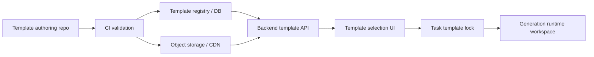

# Template-Driven Pipeline Design

## Goal

SlideSmith should support a template-driven PPT generation flow. Before generation starts, users can browse visual template cards, inspect previews, refine key options, and then generate a deck from a selected immutable template package.

The first implementation milestone only exposes a backend template catalog API backed by the existing PPT Master skill templates on disk. It does not change task state transitions, generation prompts, or frontend selection screens.

## Current State

- PPT Master templates already live under the skill package.
- Runtime workspaces copy the full `skills/ppt-master` tree, including `templates/`.
- The backend has `SLIDESMITH_PPT_MASTER_SKILL_DIR`, but no template catalog API.
- `PhaseTemplateResolve` exists in the phase registry, but it is not active in the live workflow.
- Frontend generation currently continues from spec confirmation into SVG generation without a template selection checkpoint.

## Target State

The productized flow separates template management from task execution:

1. Template authors maintain template packages in a dedicated authoring repo.
2. CI validates template metadata, preview assets, design specs, and renderability.
3. Validated versions are published to a registry and object storage/CDN.
4. Runtime reads a selected template version and stores an immutable copy in the task workspace.
5. Generation phases use the selected template lock instead of discovering templates ad hoc.



## Template Package Shape

Development uses:

`/Users/vt/Dev_space/ppt-master/skills/ppt-master/templates`

Initial catalog sources:

- `layouts/layouts_index.json`
- `decks/decks_index.json`
- `brands/brands_index.json`

Each index maps a template key to metadata. Template directories hold visual preview assets such as `01_cover.svg`, `03_content.svg`, and `design_spec.md`.

Stable API IDs use a composite string:

- `layout:government_blue`
- `deck:中国电信`
- `brand:google`

This avoids slash routing issues while preserving the source template key.

## API Contract

### `GET /api/templates`

Returns catalog items:

```json
{
  "data": [
    {
      "id": "layout:government_blue",
      "kind": "layout",
      "name": "government_blue",
      "display_name": "government_blue",
      "summary": "Key project briefings...",
      "canvas": "ppt169",
      "default_page_count": 5,
      "page_types": ["cover", "toc", "chapter", "content", "ending"],
      "primary_color": "#00418D",
      "preview_assets": [
        {
          "name": "cover",
          "path": "01_cover.svg",
          "url": "/api/templates/layout:government_blue/assets/01_cover.svg"
        }
      ],
      "template_path": "/.../templates/layouts/government_blue",
      "design_spec_path": "/.../templates/layouts/government_blue/design_spec.md"
    }
  ]
}
```

### `GET /api/templates/:id`

Returns one catalog item by stable ID. Unknown IDs return `404`.

### `GET /api/templates/:id/assets/*path`

Returns a preview asset from inside that template directory. The backend must clean and validate the path so callers cannot escape the template directory.

## Milestones

### Milestone 1: Backend Catalog API

- Add a backend template catalog service.
- Read catalog metadata from PPT Master skill templates on disk.
- Expose `GET /api/templates`.
- Expose `GET /api/templates/:id`.
- Expose preview asset URLs and serve preview assets.
- Add focused service tests.
- No database table.
- No task state-machine changes.
- No frontend template selection UI.

### Milestone 2: Frontend Visual Selection

- Add template card grid before generation starts.
- Render SVG/PNG previews from the asset API.
- Allow filtering by kind, canvas, brand, style, and page count.
- Persist only the selected template ID in the client until backend task locking exists.

Implementation note:

- `#/new` now loads `GET /api/templates` and renders selectable template cards before task creation.
- The frontend supports kind, canvas, page-count, and text filters.
- Preview images use the backend asset URLs returned by the catalog API.
- At Milestone 2 completion the selected template ID was stored in `sessionStorage` only. Milestone 3 now submits it to the backend as `template_id`.

### Milestone 3: Template Lock

- Add task-level selected template metadata.
- Store immutable template ID, version, source path, and checksum in task state.
- Copy only the selected template package into runtime workspace.

Implementation note:

- `POST /api/tasks` accepts `template_id` and persists `selected_template_id` plus `template_lock_json`.
- The lock captures template kind/name, source path, checksum, canvas, default page count, page types, primary color, previews, and lock timestamp.
- Runtime workspaces write `.slidesmith/template_lock.json`.
- `runtime_manifest.json` records `selected_template_id`, `template_lock`, and the selected template root.
- The workspace keeps shared template references plus chart/icon assets, but trims `layouts/`, `decks/`, and `brands/` to the selected package only.

### Milestone 4: Pipeline Integration

- Activate `template_resolve` as a real phase.
- Feed selected template metadata into spec generation.
- Ensure spec confirmation still blocks SVG execution.

Implementation note:

- Prepare now records a real `template_resolve` phase after `source_prepare` succeeds and before the task enters anchor confirmation.
- The phase writes `.slidesmith/template_resolution.json` with the resolved template root, lock path, selected template ID, and prepared project path.
- Spec generation phase input references `.slidesmith/template_resolution.json` and `.slidesmith/template_lock.json`.
- Full PPT Master prompts now explicitly instruct the agent to read `template_resolution.json` and use its `template_root`.
- `confirm_ui/result.json` carries the selected template lock, and spec preview summary includes `selected_template_id`.
- The existing `refine_spec=true` gate remains intact: spec generation can stop at `awaiting_spec_confirm`, and SVG execution is only queued after explicit continue/confirmation.

### Milestone 5: Productized Registry

- Move from local disk discovery to registry-backed metadata.
- Store preview assets in object storage/CDN.
- Support versioning, deprecation, and compatibility constraints.

Implementation note:

- The backend now migrates `template_registry_entries` and syncs registry metadata from the current PPT Master disk templates on server startup.
- `GET /api/templates`, `GET /api/templates/:id`, asset serving, and task template locks read registry records first. The task lock uses registry `version`, `checksum`, `status`, previews, and compatibility metadata.
- Startup sync preserves manually maintained `status` and `version`, so operators can deprecate or disable a template without having it reset by disk discovery.
- Preview bytes are still served from the local template package. Object storage/CDN publication remains the next productization step once the registry schema is stable.

## Open Interaction Issue

Manual testing showed that after SPEC generation and confirmation, the UI goes directly into SVG generation. The previous interactive choices for page count, style, images, and similar options are currently skipped. This document records that as a later interaction design gap; Milestone 1 only creates the backend catalog foundation.
